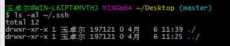
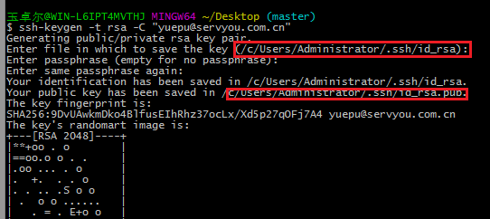
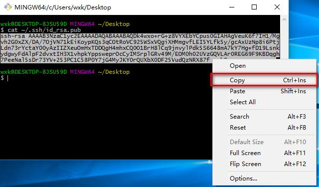
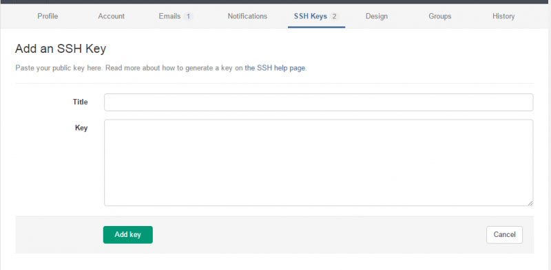

## GIT安装配置说明  

git用来管理源代码

### 安装
官方网站：https://git-scm.com/

### 配置用户名
在桌面任意地方右键，打开git bash,依次输入以下命令
```
git config --global user.name "金澄"
git config --global user.email "jinc@servyou.com.cn"
```
**注意替换成自己的名称和邮箱地址**  

### 配置git-lab  
#### ssh-key说明  
ssh-key是用来从本地git程序访问git服务的一种认证方式，避免了使用用户名和密码。

#### 查看本地是否已经存在ssh-key  
安装git以后，在桌面任意地方右键，打开git bash ,输入命令

```
ls -al ~/.ssh
```
检查是否显示有id_rsa.pub或者id_dsa.pub存在（资源管理器直接看也可以）  
如图所示：没有该文件  


#### 生成ssh-key  
如果没有ssh-key，则使用以下命令生成  
```
ssh-keygen -t rsa -C "jinc@servyou.com.cn"
```
**注意替换成自己的名称和邮箱地址**

一路回车  


#### 复制生成好的key  
在git-bash中，可以使用以下命令查看public key:
```
cat ~/.ssh/id_rsa.pub
```
将public-key复制下来  


#### 登录gitlab  
访问地址：http://192.168.2.107/  
用户名：税友邮箱前缀  
密码： 税友邮箱密码  

#### 上传ssh-key
  


在key中，粘贴id_rsa.pub并保存。

### 参考资料
内网资料：http://192.168.2.98/bbs/forum.php?mod=viewthread&tid=42185&highlight=GIT  
外网资料：http://www.bootcss.com/p/git-guide/