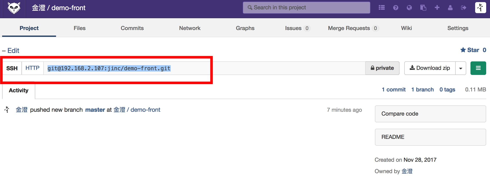
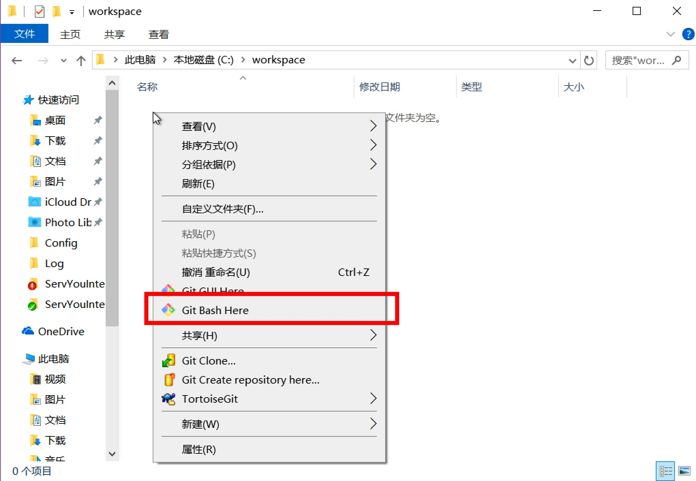
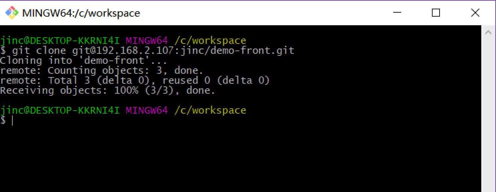
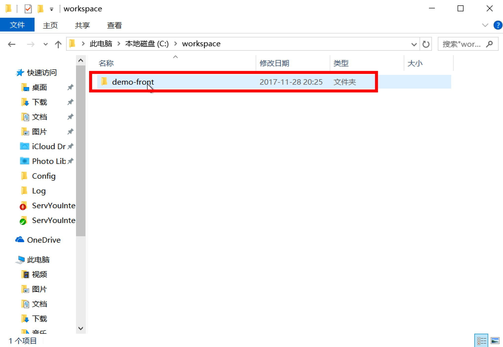
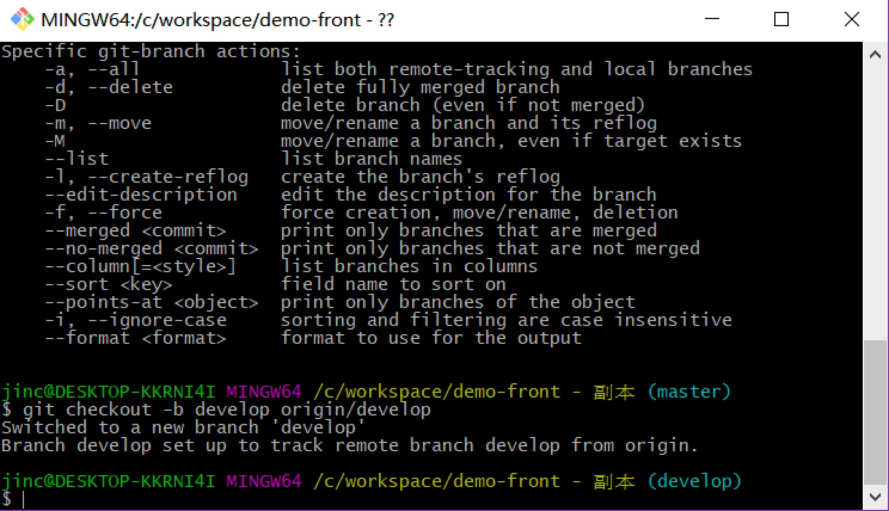
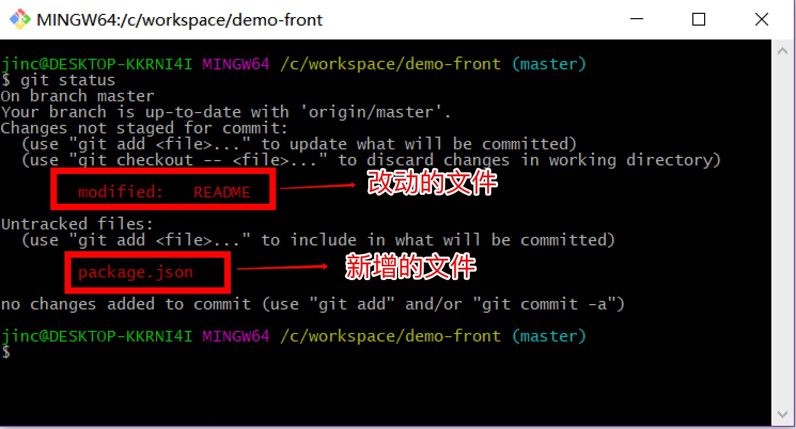
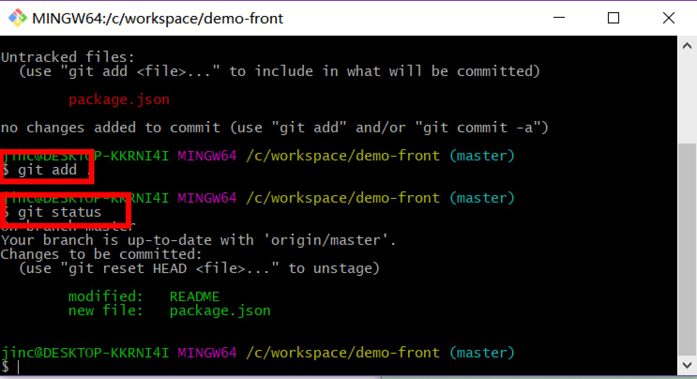
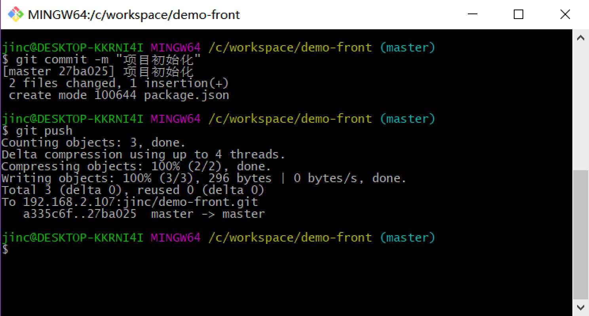
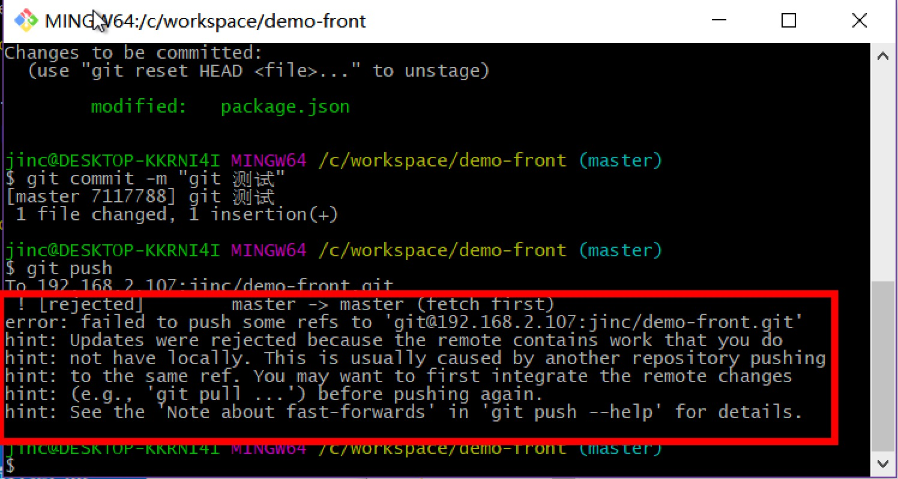
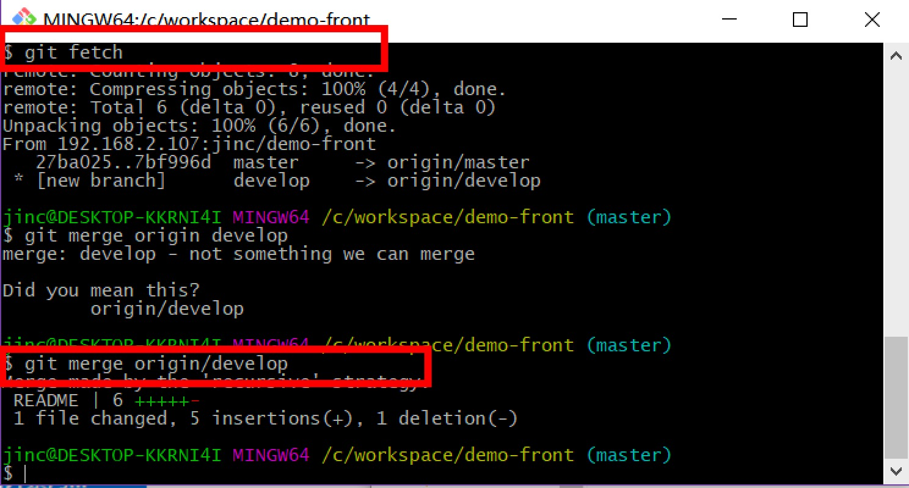

## GIT初级使用说明

### gitlab权限  
**在使用gitlab克隆一个项目前，请找辅导老师开通gitlab的访问权限**

### 从gitlab上克隆一个项目  

假设项目的工作目录为：D:\workspace  
在D:\workspace目录中，鼠标右键打开git bash，输入以下命令

```
git clone git@192.168.2.107:jinc/demo-front.git
```
**git clone 后面的项目地址从gitlab上来**



  

**将下载并生成项目目录**
  

### 切换一个分支
clone下来的代码通常在master分支上，但通常情况，我们**禁止在master上直接改代码**，因此，需要切换到一个新的分支上做开发，例如develop分支。

#### 创建并切换到新的分支
第一次本地计算机上是没有develop分支的，但gitlab中有，因此需要新建并切换到develop分支上：

```
git checkout -b develop origin/develop
```
**develop是分支名**
  


#### 切换到一个已有的本地分支
```
git checkout master
```  

### 提交一个改动
场景： 项目中对文件进行了修改，需要提交到gitlab中。

#### 查看当前项目的状态
项目改动文件后，可以在git bash中使用以下命令查看当前的改动
```
git status
```  
**通过该命令检查我们提交的文件确实是我们这一次的改动**
  

#### 添加改动的文件  
使用以下命令将改动的文件添加到本地仓库
```
git add .
```  
#### 再次检查项目状态
再次输入以下命令，检查项目状态
```
git status
```  
  

#### 提交到本地仓库
```
git commit -m "这里填写提交的说明"
```  

#### 推送到远程仓库  
```
git push
```  
  

### 合并一个改动
场景： 项目中对文件进行了修改，但其他人也对项目进行了修改。

#### 命令简介
普通的提交代码在最后一步git push时报错
```
git status
git add .
git status
git commit -m "这里填写提交的说明"
git push
```

查看报错原因，可以看出是其他人已经提交了，代码不是最新的
```
Updates were rejected because the remote contains work that you do
hint: not have locally.
```
  

使用以下命令获取最新代码
```
git fetch
```
合并之后提交
```
git merge origin/develop
git status
git push
```
 


### 其他场景
在git使用过程中，我们还会遇到新建仓库，新建分支，解决合并冲突，撤销提交内容等复杂场景。相信各位学会基础的使用以后，可以在使用过程中逐渐熟练。


### 参考资料
http://www.bootcss.com/p/git-guide/