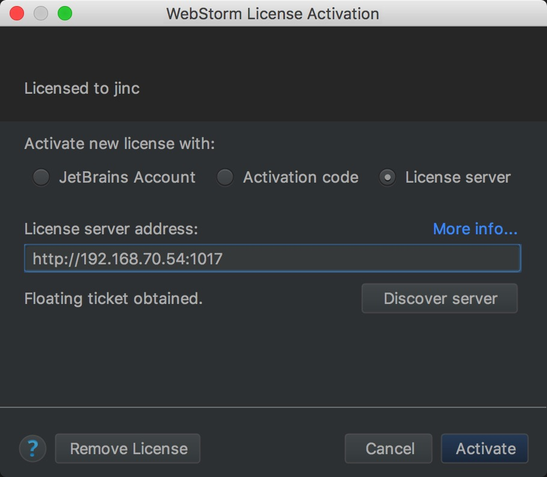

## IDE-WebStorm安装使用说明

前端暂时使用WebStorm作为开发工具

### 官方网站
网址：https://www.jetbrains.com/webstorm/


### 安装

一路下一步

#### 是否导入配置
是否导入配置，选否


#### 激活
使用服务器激活：
```
http://192.168.70.54:1017
```



### 常用快捷键

- Ctrl+R 替换
- Ctrl+Shift+F 全局搜索
- Ctrl+Shift+N 打开一个文件
- Ctrl+Alt+L 格式化代码
- Ctrl+W 选择光标所在单词，继续按有惊喜
- Ctrl+D 复制光标所在行
- Ctrl+X 剪切光标所在行
- Ctrl+Y 删除当前行
- Ctrl+Alt+左右 光标上一次下一次停留位置
- Alt+J 多选选择下一个单词（配合Ctrl+W）
- Ctrl+L 多选时跳过单词