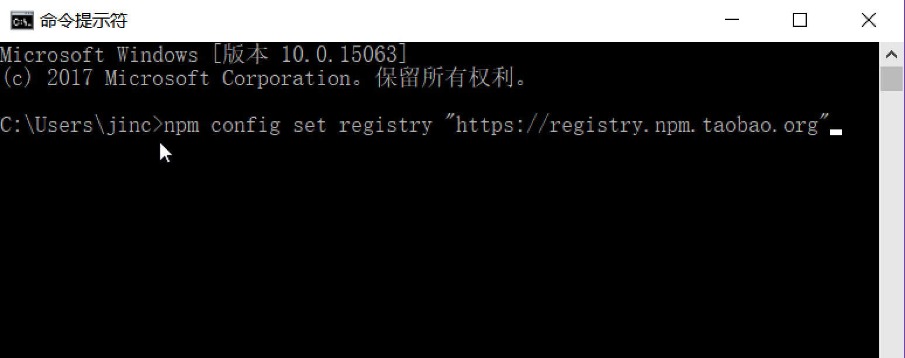
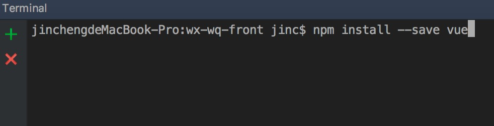
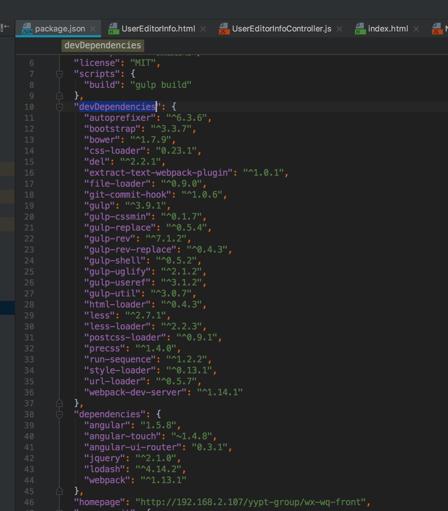

## node.js和npm安装使用说明

纯前端项目，nodejs用来执行打包脚本等功能，nodejs包含了npm命令

### 官方网站
官网：https://nodejs.org

第三方：http://nodejs.cn/

### 安装nodejs+npm
下载安装即可。如果使用绿色版，需要配置环境变量。


## npm 使用说明

实际使用过程中，yarn更好用一点，信息部前端组已切换到[yarn](5-yarn安装使用说明.md)。

### 设置npm淘宝镜像
npm是一个包管理工具，可以用来下载第三方包，也可用来执行 npm脚本。  

官方网站：https://www.npmjs.com/

由于npm在国内没有官方的服务，但是淘宝做了一个镜像，因此将仓库地址改到淘宝镜像明显提高速度。

win+r 运行cmd

```
 npm config set registry "https://registry.npm.taobao.org"
```




### 常用npm命令

#### 安装npm依赖
在现有的项目下，通常已经存在package.json文件，常用以下命令安装依赖包
```
npm install
```

#### 增加一个dependency
package.json中的dependencies用于项目实际依赖，通常会一起打包

使用以下命令增加一个依赖包

```
npm install --save 包名
```
例如


#### 增加一个devDependency
devDependencies只用于开发阶段使用
```
npm install --save-dev 包名
```
安装成功以后，会相应添加到package.json文件中


### 初始化一个package.json
在创建一个新的前端项目时，使用以下命令进行初始化：
```
npm init
```

### nodejs个性化配置补充

#### 设置插件的存放路径：

node插件默认存放在users下面，如果想修改位置，可以执行以下命令：
```
npm config set prefix "D:\Front\Nodejs\node_global"
npm config set cache "D:\Front\Nodejs\node_cache"
```
**引号内替换成你想要的位置**

或者手动修改文件：
```
nodejs的安装目录中找到node_modules\npm\.npmrc文件
prefix = D:\Front\Nodejs\node_global
cache = D:\Front\Nodejs\node_cache
```


#### 设置环境变量
如果修改了插件位置，或者使用绿色版的nodejs，那么需要修改环境变量

```
path新增:全局安装以后的插件的path，
D:\Front\Nodejs\node_global
npm和node的path
D:\Front\Nodejs
```


