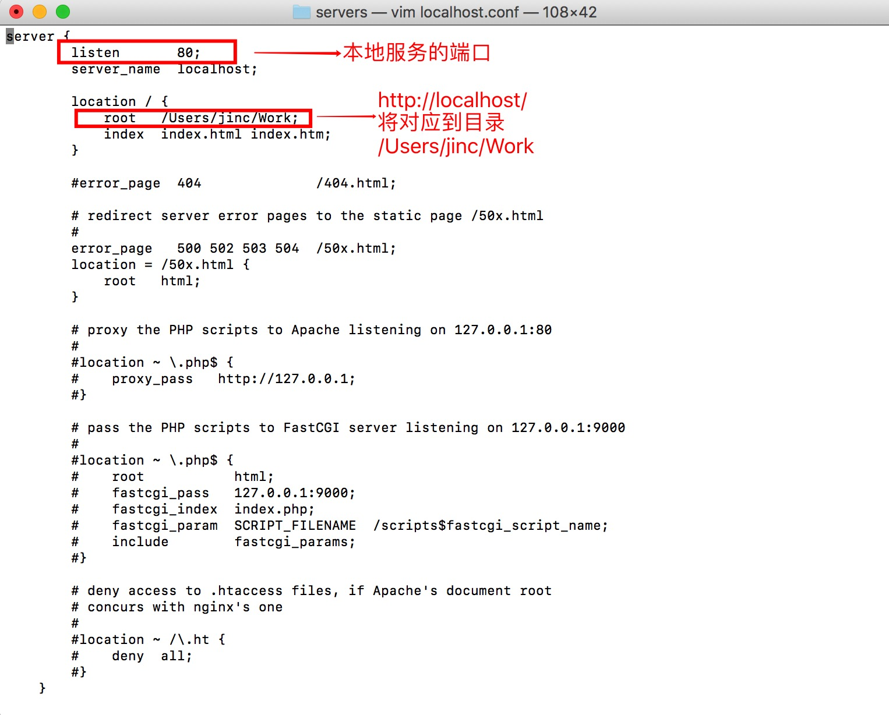
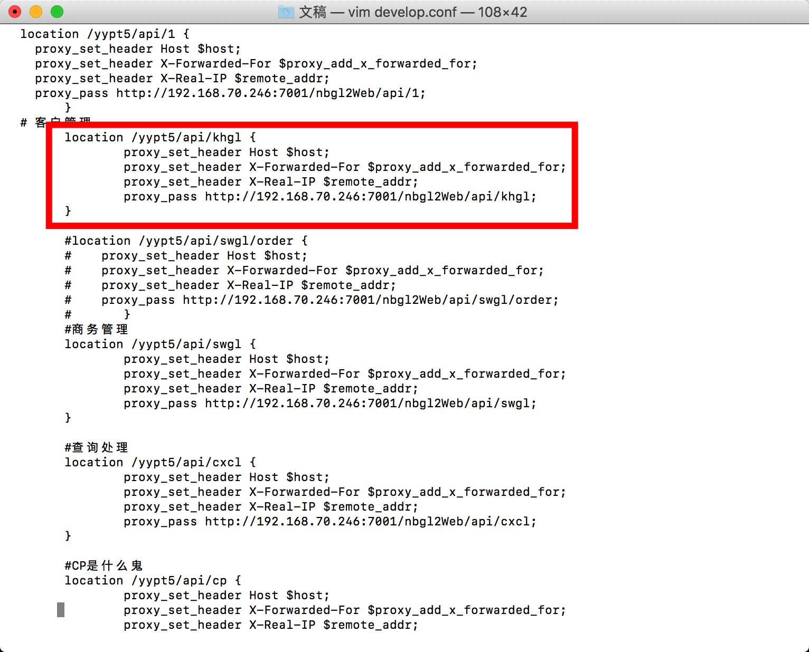

## nginx安装使用说明

nginx在前端现阶段用于前端静态资源的服务，以及使用反向代理解决跨域问题。

### windows下安装
官网：http://nginx.org/en/download.html

### 安装
解压即可使用

### 重启nginx的批处理文件
在nginx目录新建一个批处理：nginx.bat
内容如下：
```
taskkill /f /t /im nginx.exe
start nginx.exe
```
可以把批处理发送到桌面快捷方式

### nginx.conf极简说明

nginx.conf文件位于nginx安装目录conf文件夹

#### 配置本地服务端口
修改nginx.conf文件，在Server节点中，修改listen的端口

#### 配置本地服务指向的物理路径根目录
修改nginx.conf文件，在Server中，修改root路径



#### 配置反向代理

举例：

以下地址开头的请求

http://localhost/yypt5/api/khgl

将反向代理到以下地址开头

http://192.168.70.246:7001/nbgl2Web/api/khgl



### nginx配置示例

```
# 添加一个服务
server{
	listen 80; # 监听端口等同port
	server_name localhost; # 服务名称
	# / => 所有请求, 默认使用到的规则
	location / {
		root html; # 前端文件所在路径documentRoot，相对路径时相对于nginx安装目录
		index index.html; # 首页地址
	}
	# 反向代理 /yypt5/api/khgl/...这类请求
	location /yypt5/api/khgl {
		#最后带/会影响代理结果
		proxy_pass 192.168.2.702:8001; 
		#以下是一些反向代理的非必需配置，一般在开发时可以删除
        proxy_redirect             off; 
        #后端的Web服务器可以通过X-Forwarded-For获取用户真实IP
        proxy_set_header           Host $host; 
        proxy_set_header           X-Real-IP $remote_addr; 
        proxy_set_header           X-Forwarded-For $proxy_add_x_forwarded_for; 
		#允许客户端请求的最大单文件字节数
        client_max_body_size       10m; 
		#缓冲区代理缓冲用户端请求的最大字节数
        client_body_buffer_size    128k;
		#nginx跟后端服务器连接超时时间(代理连接超时)		
        proxy_connect_timeout      300; 
		#后端服务器数据回传时间(代理发送超时)
        proxy_send_timeout         300; 
		#连接成功后，后端服务器响应时间(代理接收超时)
        proxy_read_timeout         300;
		#设置代理服务器（nginx）保存用户头信息的缓冲区大小		
        proxy_buffer_size          4k; 
		#proxy_buffers缓冲区，网页平均在32k以下的话，这样设置
        proxy_buffers              4 32k; 
		#高负荷下缓冲大小（proxy_buffers*2）
        proxy_busy_buffers_size    64k; 
		#设定缓存文件夹大小，大于这个值，将从upstream服务器传
        proxy_temp_file_write_size 64k; 
	}
}
```