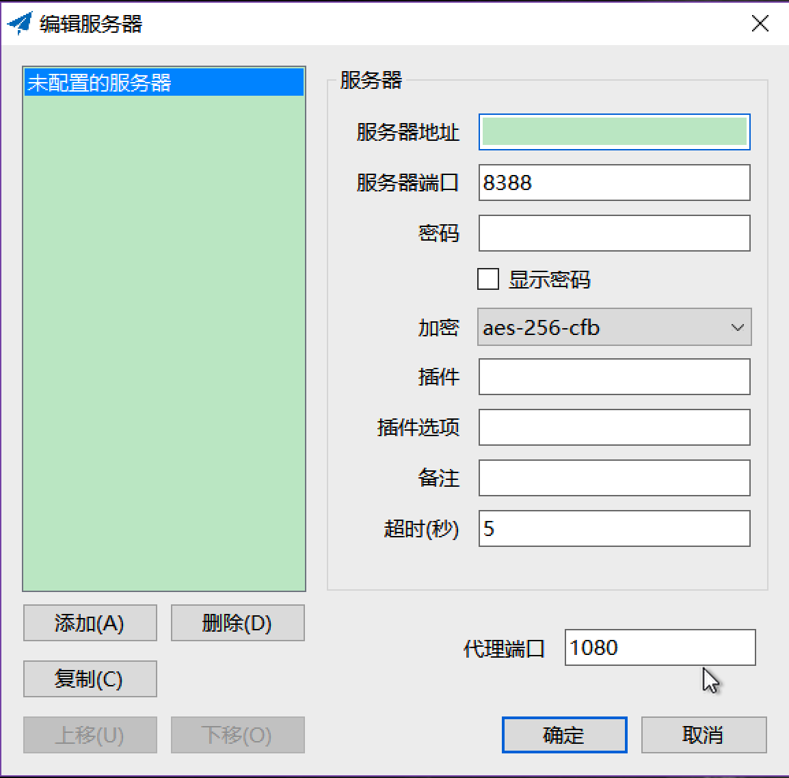
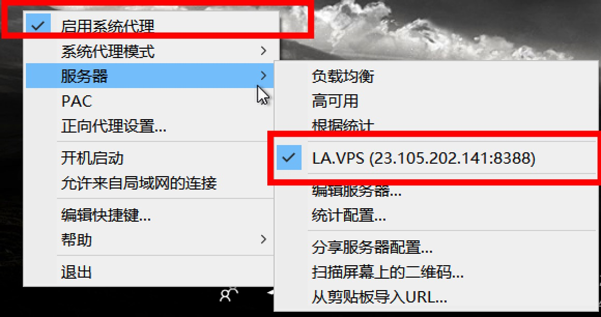
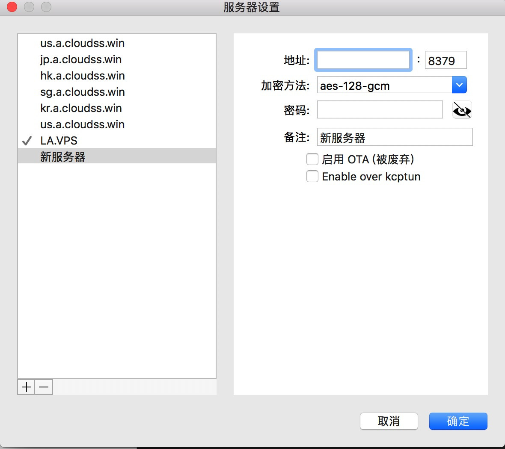
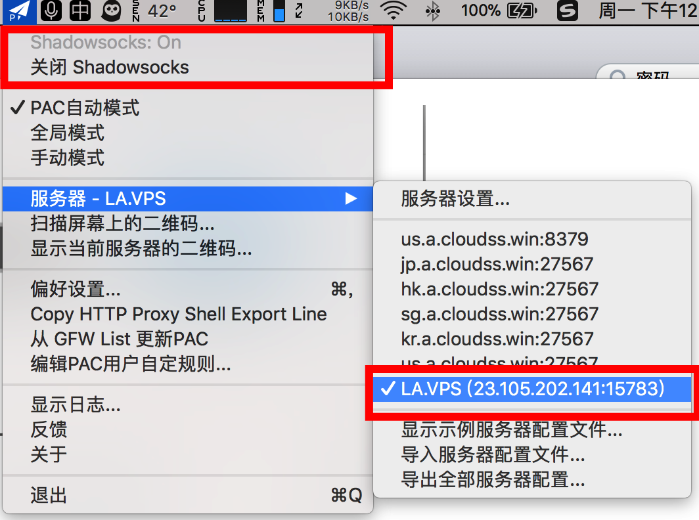

# 科学上网

## 一、Windows版

### 1. 下载安装

下载地址:

https://github.com/shadowsocks/shadowsocks-windows

解压即可使用，如果不能运行，请安装依赖项：.net 4.6.2以及vc++2015：

[.net 4.6.2 下载地址](https://www.microsoft.com/en-US/download/details.aspx?id=53344)

vc++2015 选x86版

[Microsoft Visual C++ 2015](https://www.microsoft.com/en-us/download/details.aspx?id=53840)

### 2. 设置服务器

地址密码配置@前端组

### 3. 启用

选择新增的服务器以后，选择启用系统代理。

### 4. 愉快的试试google

https://www.google.com/ncr

## 二、Mac版

### 1. 下载

下载地址:

https://github.com/shadowsocks/ShadowsocksX-NG

### 2. 安装

打开下载的dmg文件，将程序图标拖到右边的Applications，安装完成

### 3. 打开服务器设置

进入Launchpad，打开ShadowsocksX程序，程序图标出现在右上方，点击图标-“服务器”-“服务器设定”

### 4. 设置服务器

地址密码配置@前端组

### 5. 启用

选择新增的服务器以后，选择启动。

启动以后：状态应该为：Shadowsocks:On

### 6. 愉快的试试google

https://www.google.com/ncr

