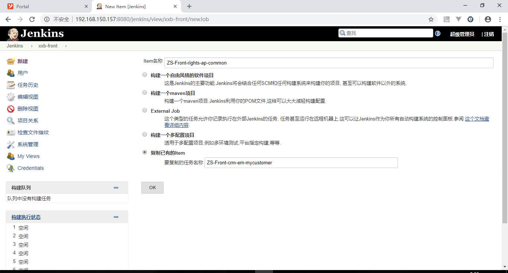
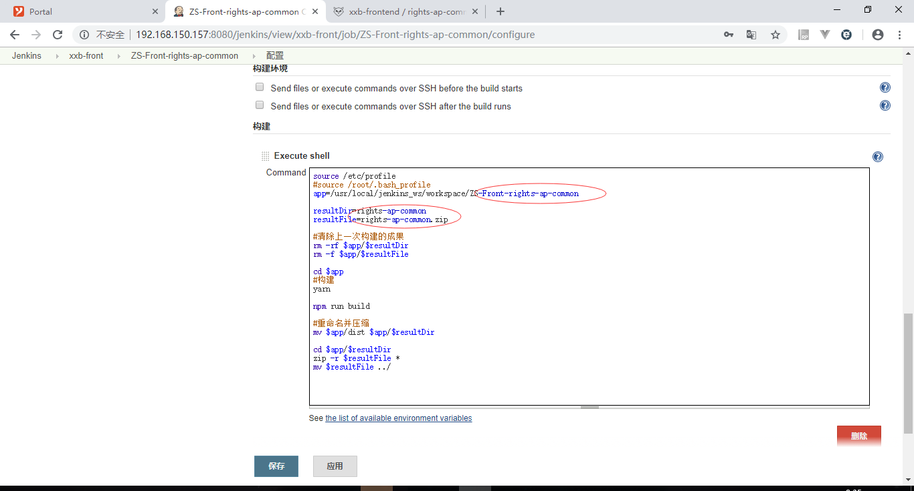

**步骤一**：

到这个http://192.168.150.157:8080/jenkins/

账号密码问金澄

**步骤二**：

在这个页面，选一个以前的规范的项目，复制下名字。

**步骤三**：
item名称就成了ZS-Front后面加你的项目名，复制已有的item里面写你步骤二复制的项目名。

**步骤四**：

#### 


要改的地方，第一处：改成你的项目的git地址，第二处：改成你的项目的名称。

**步骤五**：

点击保存，然后点击立即构建。


**步骤六**：

去看构建日志，怎么看？直接点蓝色小球，如图：


如果你看到构建成功了，那就可以找运维中心的人，让他们建一个发布任务。

如果你看到构建失败了，那就自己改代码，改完再重新构建看看，直到成功。

**步骤七**：

给运维中心的人发以下东西，我举个例子：

比如你构建完的图片是这样的：


那么可以看到三个红圈里的东西，jenkins地址就是url地址中去掉"1/console"

项目成果名就是你的项目名后面加.zip

部署的域名和物理路径，根据你测试环境部署的域名，路径问金澄

```
jenkins的地址：http://192.168.150.157:8080/jenkins/view/xxb-front/job/ZS-Front-rights-ap-common/
项目成果名：rights-ap-common.zip
部署的域名：biz.17win.com
物理路径：10.64.0.4下的 /servyouapp/front/
```

