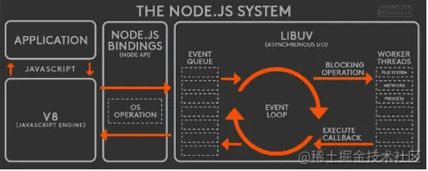

1. electron 通信原理
2. vue v-pre v-cloak v-once 
3. node.js异步
4. async await 存在问题（当读取大文件时，如何保证用户不等待）
5. http 组成
6. get post
7. http 头的方式实现短线续传
8. python
9. sql 
10. node垃圾回收机制

# 1. electron 进程通信原理
## 1.1 几种通信方式
### 1.1.1 IPC模块(ipcMain和ipcRenderer, 他们都是EventEmitter的实例)
1. ipcMain
   监听渲染进程发送的同步或异步消息，通过  `event.reply`在回复渲染进程

2. ipcRenderer

   
使用 `remote` `模块相对来说会比较自然一点。remote` 模块帮我们屏蔽了内部的进程通信，使得我们在调用主进程的方法时完全没有感知到主进程的存在。

### 1.1.2 通信原理
主进程和渲染进程通过IPC，采用发布订阅的模式进行通信。
`ipcMain`和`ipcRender`都是eventEmitter类的一个实例。而 `EventEmitter` 类由 NodeJS 中的 `events` 模块导出`events.EventEmitter`

### 1.1.3 eventEmitter(发布订阅设计模式-也成为消息机制)

electron IPC（inter-process communication）通信基于events.EventEmitter实现，核心就是事件触发与事件监听器功能的封装
demo
```
   const myEE = new EventEmitter();
   myEE.on('foo', () => console.log('a'));
   myEE.prependListener('foo', () => console.log('b'));
   myEE.emit('foo');
```

它有如下api:
- once
- on(addListener)
- emit
- eventNames
- removeAllListener
- removeListener
- off
- prependOnceListener
- ...

### 1.1.2 webContents.send方法（异步） 
   主进程只能向渲染进程发布异步消息
webContents是一个EventEmitter. 负责渲染和控制网页, 是 BrowserWindow 对象的一个属性。 这是一个访问 webContents 对象的例子:
### 1.1.3 remote模块

本来新的渲染进程只有主进程才可以创建，不过有了remote模块 我们也可以在一个渲染进程中创建另一个渲染进程；
```
   const {BrowserWindow} = require('electron').remote;
   let wind = new BrowserWindow({
      width:800,
      height:600
   });
   win.loadUrl('https://github.com');
```
其实就是对消息的进一步封装，也就是根据传递的消息，调用不同的方法，形式上就像调用本进程的方法一样，但其实是发消息到另一个进程来做的，和 ipcMain、ipcRenderer 的形式本质上一样。

概括:remote看上去像直接调用，但本质还是消息发布订阅的模式来进行通信。

## 1.2 发布订阅模式
- 发布者
- 事件中心
- 订阅者
  
订阅者（N个）注册时间到消息中心（Event Channel）, 发布者（Publisher）触发事件(emiter)，消息中心收到触发的事件后通知订阅者
```
 ╭─────────────╮                 ╭───────────────╮   Fire Event   ╭──────────────╮
 │             │  Publish Event  │               │───────────────>│              │
 │  Publisher  │────────────────>│ Event Channel │                │  Subscriber  │
 │             │                 │               │<───────────────│              │
 ╰─────────────╯                 ╰───────────────╯    Subscribe   ╰──────────────╯

```

**node中**
### 1.2.1 对比观察者模式区别
- 观察者
- 目标

观察者模式：观察者（Observer）直接订阅（Subscribe）主题（Subject）,而当目标发生变化通知所有观察者
```
 ╭─────────────╮FireEvent（触发事件) ╭──────────────╮
 │             │───────────────────>│              │
 │   Subject   │                    │   Observer   │
 │             │<───────────────────│              │
 ╰─────────────╯    Subscribe（订阅）╰──────────────╯

著作权归作者所有。商业转载请联系作者获得授权，非商业转载请注明出处。
```


# 2. vue:v-pre v-cloak v-once 、vue生命周期
```
v-pre:在模板中跳过vue的编译，直接输出原始值。就是在标签中加入v-pre就不会输出vue中的data值了。
<div v-pre>v-pre: {{radomData}}</div>


v-cloak:不会显示，直到编译结束。
[v-cloak] {
  display: none;
}
<div v-cloak>v-cloak: {{radomData}}</div>

v-once:
在第一次DOM时进行渲染，渲染完成后视为静态内容，跳出以后的渲染过程。
<div v-once>v-once: {{onceData}}</div>
```

### vue 生命周期
1. beforeCreat:data和methods中的数据都还未初始化
2. created:此时data和methods已经初始化完成
   数据侦听(data,watch)、计算属性(computed)、方法(methods)、事件/侦听器的回调函数;
   然而，挂载阶段还没开始，且 $el property 目前尚不可用。
   created()完成之后，vue开始编译模板`compile template into function`，最终在内存中生成一个编译好的最终模板字符串，然后把模板字符串渲染为内存中的dom
4. beforeMount:在挂载开始之前被调用：相关的 render 函数首次被调用。
   表示模板在内存中已经编译好了，但是并没有渲染到页面中。页面显示的还仅仅是模板字符串
5. mounted
   此时内存中的模板已经真实的挂载到了页面中，用户可以看到渲染好的页面了
6. beforeUpdate
   表示模板在内存中已经编译好了，但是并没有渲染到页面中。页面显示的还仅仅是模板字符串
7. updated: 页面和data中的数据已经同步了
8. beforeUpdate: data中的数据已经被更新了，但是页面中的data还未被替换过来
9. actived
10. deactived
11. beforeDestory
12. destoryed
13. errorCaptured


# 3. node.js event loop

### 1. 浏览器异步
（1）所有同步任务都在主线程上执行，形成一个执行栈（execution context stack）。

（2）主线程之外，还存在一个"任务队列"（task queue）。只要异步任务有了运行结果，就在"任务队列"之中放置一个事件。

（3）一旦"执行栈"中的所有同步任务执行完毕，系统就会读取"任务队列"，看看里面有哪些事件。那些对应的异步任务，于是结束等待状态，进入执行栈，开始执行。

（4）主线程不断重复上面的第三步。

> 浏览器中：task-queue分为：宏队列(macro-task)和微队列(micro-task),执行顺序：同步任务——>微队列——>宏队列
> 规定，当宏任务和微任务都处于 Task Queue 中时，微任务的优先级大于宏任务，即先将微任务执行完，再执行宏任务
### 2. node.js 异步
[node.js事件循环](http://nodejs.cn/learn/the-nodejs-event-loop)

Node 中的 Event Loop 和浏览器中的是完全不相同的东西。Node.js采用V8作为js的解析引擎，而I/O处理方面使用了自己设计的libuv，libuv是一个基于事件驱动的跨平台抽象层，封装了不同操作系统一些底层特性，对外提供统一的API，事件循环机制也是它里面的实现（下文会详细介绍）。




#### 2.1 Node.js的运行机制如下：
- V8引擎解析JavaScript脚本。
- 解析后的代码，调用Node API。
- libuv库负责Node API的执行。它将不同的任务分配给不同的线程，形成一个Event Loop（事件循环），以- 异步的方式将任务的执行结果返回给V8引擎。
- V8引擎再将结果返回给用户。

#### 2.2 6个阶段
1. timer： 这个阶段执行timer（setTimeout、setInterval）的回调
2. I/O callbacks：处理一些上一轮循环中的少数未执行的 I/O 回调
3. idle, prepare： 仅node内部使用
4. poll: 获取新的I/O事件，适当的条件下node将阻塞在这里
5. check：执行`setImmediate()`的回调函数, [setImmediate](http://nodejs.cn/learn/understanding-setimmediate)
6. close cllbacks: 执行socket的close事件回调

微任务和宏任务在Node的执行顺序
- Node 10以前：
   执行完一个阶段的所有任务
   执行完nextTick队列里面的内容(next tick queue 优先级大于其他微任务)
   然后执行完微任务队列的内容
  
- Node 11以后： 和浏览器的行为一致。

```
   ┌───────────────────────────┐
┌─>│           timers          │ // 定时器检查节点
│  └─────────────┬─────────────┘
│  ┌─────────────┴─────────────┐
│  │     pending callbacks     │  // >I/O事件回调阶段
│  └─────────────┬─────────────┘
│  ┌─────────────┴─────────────┐
│  │       idle, prepare       │ // 闲置阶段       
│  └─────────────┬─────────────┘      ┌───────────────┐
│  ┌─────────────┴─────────────┐      │   incoming:   │
│  │       poll  轮询           │<─────┤  connections, │ // 外部输入数据
│  └─────────────┬─────────────┘      │   data, etc.  │
│  ┌─────────────┴─────────────┐      └───────────────┘
│  │        check   检查        │
│  └─────────────┬─────────────┘
│  ┌─────────────┴─────────────┐
└──┤      close callbacks      │
   └───────────────────────────┘
```

# 4. Promise
[promise 和 async await 的联系 常见使用问题 实现原理](https://www.wulisensen.com/#%E5%A6%82%E6%9E%9C%E6%98%AF%E5%B9%B6%E8%A1%8C%E6%89%A7%E8%A1%8C)
   async await 函数中，多个await每一行都会 等待上一行的结果返回后才会执行。
   
   解决：
   1. Promise.all()
   2. 还可以 先初始化Promise，在需要获取值得地方 再await
   ```
      const start = new Date();

      const a1 = getValue();
      const b1 = getValue();
      const c1 = getValue();

      const a = await a1;
      const b = await b1;
      const c = await c1;

      console.log(new Date() - start); // 100
   ```
# 5. http 组成
- **请求**
   1. 请求行
   2. 请求头
   3. 空行
   4. 请求体

```
   POST / HTTP1.1 // 请求行
   Host:www.wrox.com
   User-Agent:Mozilla/4.0 (compatible; MSIE 6.0; Windows NT 5.1; SV1; .NET CLR 2.0.50727; .NET CLR 3.0.04506.648; .NET CLR 3.5.21022)
   Content-Type:application/x-www-form-urlencoded
   Content-Length:40
   Connection: Keep-Alive

   name=Professional%20Ajax&publisher=Wiley // 请求体
```
- **响应**
   1. 状态行
   2. 响应头
   3. 空行
   4. 响应正文

# 6. get post
# 7. http 头的方式实现短线续传
**Range & Content-Range**
   HTTP1.1 协议（RFC2616）开始支持获取文件的部分内容，这为并行下载以及断点续传提供了技术支持。它通过在 Header 里两个参数实现的，客户端发请求时对应的是 Range ，服务器端响应时对应的是 Content-Range

- Range : 用于请求头，指定第一个字节的位置和最后一个字节的位置：`Range:(unit=first byte pos)-[last byte pos]`
- Content-Range : 用于响应头：`Content-Range: bytes 0-499/22400`


# 8. python
# 9. sql 