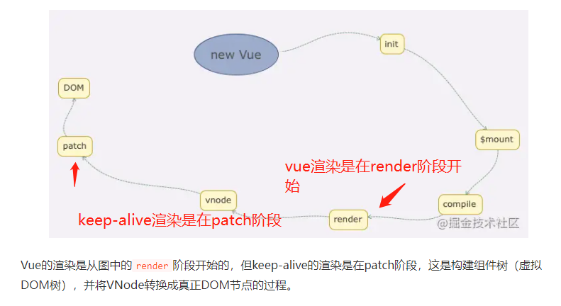
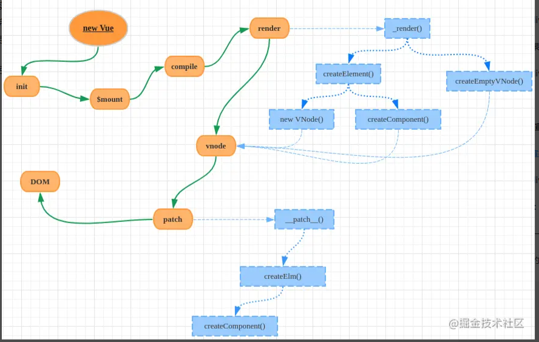
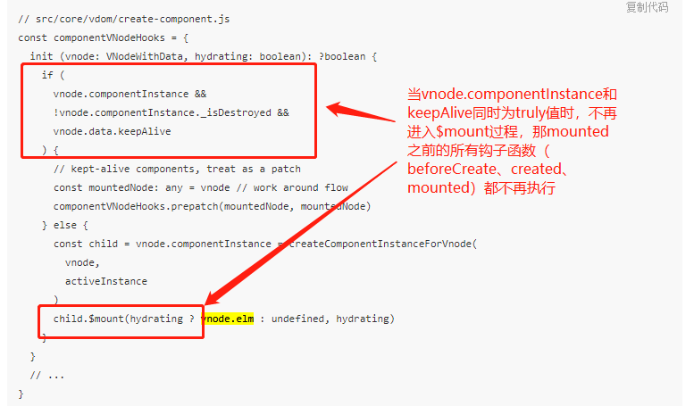

1. 深拷贝 的方式 √
2. 为什么mapState 解构放在compued里, 不放在data里 √
3. keep-live原理，react-router如何实现keep-alive √
4. webpack 做过哪些配置，多人协作 ×
5. 如何写一个webpack插件 ×
6. 大屏响应式rem, vw,vh √
7. class Component和function Component区别 √
8. nginx优化 √
9. 前端做过哪些优化

# 1. 浅拷贝，深拷贝 的方式
##### 浅拷贝：
   - Object.assign: 是浅拷贝
   - lodash_.clone()
   -  `...`展开运算符，是浅拷贝
   -  concat: arr.concat()
   -  slice: arr.slice()

##### 深拷贝
  - Object.assign: 对象只有一层时是深拷贝
  - JSON.parse(JSON.stringify(obj))： 是深拷贝，缺陷，如果值是function值会丢失,
  - loadash_.cloneDeep
  - 递归拷贝
  ```
    // 迭代递归法：深拷贝对象与数组
    function deepCopy(obj) {
      if (typeof obj != "object") {
        return "need a object";
      }
      var object = obj.constructor == Array ? [] : {};
      for (var i in obj) {
        //判断是对象还是普通类型
        if (typeof obj[i] == "object") {
          //这里需要判断一下是否是正则RegExp 还是 Date 时间
          if (obj[i].constructor === RegExp || obj[i].constructor === Date) {
            object[i] = obj[i];
          } else {
            object[i] = deepCopy(obj[i]);
          }

        } else {
          object[i] = obj[i];
        }
      }
      return object;
    }

  ```


# 2. 为什么mapState 解构放在compued里, 不放在data里

因为data中的内容只会在created时触发初始化一次，**具体来说就是data中设置count: this.$store.state.count 则count的值是created钩子执行前this.$store.state.count的值，赋值之后属性的值就是纯粹的字面量，之后this.$store.state.count 如何变化均影响不到count的取值。**

**而 computed 则是通过【依赖追踪】实现的，计算属性在它的相关依赖发生改变时会重新求值**

> https://segmentfault.com/q/1010000009696383

  vue的双向绑定机制简单来说，就是劫持一个属性的赋值方法setter，并触发相应的视图更新。

  在computed属性中，vue会根据函数的逻辑，自动判断依赖。比如你代码中的，
  ```
    computed:{
        topicList(){
            return this.$store.state.topicList
        } 
      }
    }
  ```
  它就知道，当这个依赖：this.$store.state.topicList 发生变化时，要重新计算 topicList 属性的值，并触发相应的更新操作。

  而data中的topicList，仅仅是对this.$store.state.topicList的一个引用。
  （如果this.$store.state.topicList 不是对象与数组的话，那就只是个赋下值给topList）。

  所以当this.$store.state.topicList变化的时候，并不会触发data中topicList的setter。

#### 补充 data 和 computed区别
1.data属性的值，不会随赋值变量的改动而改动。如果要改变这个属性的值，则需要直接给data属性赋值，视图上对这个属性的显示才会变。

2.computed属性，属于持续变化跟踪。在computed属性定义的时候，这个computed属性就与给它赋值的变量绑定了。改变这个赋值变量，computed属性值会随之改变。

**info的变化不会随着赋值给它的obj.info的改变而变化，而是视图上修改这info或者this.info='yyy'时才会改变。**
```
  // obj.info = 'xxx'
  data: { 
    info: obj.info 
    // 
  }
``` 

**在computed属性定义的时候，这个computed属性就与给它赋值的变量绑定了。改变这个赋值变量，computed属性值会随之改变。**
```
  computed: {
    cinfo(){
      return obj.info
    }
  }
```

# 3. keep-live原理，react-router如何实现keep-alive

使用keep-alive包裹动态组件时，会缓存不活动的组件实例，而不是销毁它们。


Vue的渲染是从图中的render阶段开始的，但keep-alive的渲染是在patch阶段，这是构建组件树（虚拟DOM树），并将VNode转换成真正DOM节点的过程。


### 3.1简单描述从render到patch的过程

1. vue在渲染的时候先调用原型上的`_render`函数将组建对象转化为`vnode`实例；而`_render`是通过调用`createElemnt`和`createEmptyNode`两个函数进行转化
2. `createElement`的转化过程会根据不同的情形选择`new VNode`或`createComponent`函数来做VNode实例化
3. 完成VNode实例化后，Vue调用原型上的`_update`函数把VNode渲染成为真实DOM。**这个过程是过调用`__patch__`函数完成的**。



### 3.2 keep-alive组件的渲染

#### 3.2.1 `<keep-alive></keep-alive>`不会生成DOM节点,其实现原理如下

Vue在初始化生命周期的时候，为组件实例建立父子关系会根据abstract属性决定是否忽略某个组件。在keep-alive中，设置了abstract: true，那Vue就会跳过该组件实例。
```
// src/core/instance/lifecycle.js
export function initLifecycle (vm: Component) {
  const options = vm.$options
  // 找到第一个非abstract的父组件实例
  let parent = options.parent
  /** keep-alive 设置abstract:true,跳过创建组件实例 **/
  if (parent && !options.abstract) {
    while (parent.$options.abstract && parent.$parent) {
      parent = parent.$parent
    }
    parent.$children.push(vm)
  }
  vm.$parent = parent
  // ...
}

```

#### 3.2.2 keep-alive 包裹的组件如何使用缓存？

**简单来讲：**
第一次加载组件是，将组件实例保存在缓存中，
第二次访问组件时，判断组件实例`vnode.componentInstance`和`i.keepAlive`是否为true,如果是直接将缓存的组件实例插入到父节点：`insert(parentElm, vnode.elm, refElm) // 将缓存的DOM（vnode.elm）插入父元素中`


**看源码：**
在patch阶段，会执行createComponent函数：

```
// src/core/vdom/patch.js
function createComponent (vnode, insertedVnodeQueue, parentElm, refElm) {
    let i = vnode.data
    if (isDef(i)) {
      const isReactivated = isDef(vnode.componentInstance) && i.keepAlive
      if (isDef(i = i.hook) && isDef(i = i.init)) {
        i(vnode, false /* hydrating */)
      }

      if (isDef(vnode.componentInstance)) {
        initComponent(vnode, insertedVnodeQueue)
        insert(parentElm, vnode.elm, refElm) // 将缓存的DOM（vnode.elm）插入父元素中
        if (isTrue(isReactivated)) {
          reactivateComponent(vnode, insertedVnodeQueue, parentElm, refElm)
        }
        return true
      }
    }
  }

```
- 首次加载被包裹组件时，由keep-alive.js中的render函数可知，vnode.componentInstance的值是undefined，keepAlive的值是true，因为keep-alive组件作为父组件，它的render函数会先于被包裹组件执行；那么就只执行到i(vnode, false /* hydrating */)，后面的逻辑不再执行；
- 再次访问被包裹组件时，vnode.componentInstance的值就是已经缓存的组件实例，那么会执行insert(parentElm, vnode.elm, refElm)逻辑，这样就直接把上一次的DOM插入到了父元素中。


## 3.3 钩子函数



**看源码**
可以看出，当vnode.componentInstance和keepAlive同时为truly值时，不再进入$mount过程，那mounted之前的所有钩子函数（beforeCreate、created、mounted）都不再执行。

被缓存的组件实例会为其设置keepAlive = true，而在初始化组件钩子函数中：
```
// src/core/vdom/create-component.js
const componentVNodeHooks = {
  init (vnode: VNodeWithData, hydrating: boolean): ?boolean {
    if (
      vnode.componentInstance &&
      !vnode.componentInstance._isDestroyed &&
      vnode.data.keepAlive
    ) {
      // kept-alive components, treat as a patch
      const mountedNode: any = vnode // work around flow
      componentVNodeHooks.prepatch(mountedNode, mountedNode)
    } else {
      const child = vnode.componentInstance = createComponentInstanceForVnode(
        vnode,
        activeInstance
      )
      child.$mount(hydrating ? vnode.elm : undefined, hydrating)
    }
  }
  // ...
}

```
可以看出，当vnode.componentInstance和keepAlive同时为truly值时，不再进入$mount过程，那mounted之前的所有钩子函数（beforeCreate、created、mounted）都不再执行。

### 3.4 actived, deactived
1. activated：在 keep-alive 组件激活时调用
2. deactivated：在 keep-alive 组件停用时调用

我们在实际开发项目中会有一些需求，***比如跳转到详情页面时，需要保持列表页的滚动条的位置，返回的时候依然在这个位置，**这样可以提高用户体验，这个时候就可以使用缓存组件 keep-alive 来解决。

设置了 keep-alive 缓存的组件，会多出两个生命周期钩子：

首次进入组件时：`beforeRouteEnter > beforeCreate > created > mounted > activated > ... ... > beforeRouteLeave > deactivated`
再次进入组件时：`beforeRouteEnter > activated > ... ... > beforeRouteLeave > deactivated`

可以看到，缓存的组件中 `activated` 钩子函数每次都会触发，所以可以通过这个钩子判断，当前组件时需要使用缓存的数据还是重新调用接口加载数据。如果未使用keep-alive 组件，则在页面回退时会重新渲染页面，首次进入组件的一系列生命周期也会一一被触发。

离开组件时，使用了 keep-alive 不会调用 beforeDestroy 和 destroyed 钩子，因为组件没被销毁，被缓存起来了。所以 `deactivated` 这个钩子可以看作是 beforeDestroy 和 destroyed 的代替，缓存组件销毁的时候要做的一些操作可以放在这个里面。


### 3.5 keep-alive总结
被`keep-alive`标签包裹的组件在第一次初始化时（渲染从render开始）会被缓存起来（以vnode的形式），再次访问时（actived生命周期）从缓存中读取并从patch阶段开始渲染。
Vue的渲染是从图中render阶段开始的，但**keep-alive的渲染是在patch阶段，这是构建组件树（虚拟DOM树），并将VNode转换成真正DOM节点的过程。**

### 3.6 react实现keep-alive
1. react-keep-alive
2. react-activation
3. Portals:将组件渲染到父节点以外的DOM上，可以是内存中的。先通过 document.createElement 在内存中创建一个元素，然后再通过 React.createPoral 把 React 子节点渲染到这个元素上，这样就实现了“空渲染”。再次显示时将这个portal的元素渲染到页面Dom中。
4. react-keeper
5. react-router-cache-route
6. react-live-router
7. display:none

> 参考
> 
> [彻底揭秘keep-alive原理](https://juejin.cn/post/6844903837770203144)
> [Vue 全站缓存之 keep-alive](https://blog.csdn.net/wangwengrui40/article/details/113762184)
> [Vue源码解析，keep-alive是如何实现缓存的？](https://www.cnblogs.com/chanwahfung/p/13523396.html)
> [别问我[vue]，VNode、elm、context、el是个啥？](https://blog.csdn.net/junhuahouse/article/details/107425852)
> [vue的Vnode 和 patch机制](https://segmentfault.com/a/1190000022302960)
> [Vue3.0 核心源码解读 | KeepAlive 组件：如何让组件在内存中缓存和调度](http://www.eggcake.cn/posts/2021-01-23-vue3-core-source-code-23)

# webpack做过哪些优化配置

提升编译速度：
1. DLL:使用 DllPlugin 进行分包，使用 DllReferencePlugin(索引链接) 对 manifest.json 引用，让一些基本不会改动的代码先打包成静态资源，避免反复编译浪费时间
2. module.noParse避免编译非AMD, CommonJs规范的包，`jquery...`

优化开发体验：
1. resolve.alias: 设置别名，介绍webpack搜索时间，同时开中也比较方便
2. resolve.extensions: 自动带入后缀尝试去匹配对应的文件，不用写后缀名

> [Webpack配置全解析（优化篇）](https://juejin.cn/post/6858905382861946894)


# 4. webpack 做过哪些配置，多人协作 ×

# 5. 如何写一个webpack插件 ×

# 6. 大屏响应式rem, vw,vh
### 6.1 rem
实现原理： 根据屏幕宽度，计算1rem的宽度，配置根元素的font-size,所有的像素单位按照rem计算

优点：实现响应式，根据设计稿和VW的宽度实现界面宽度百分百展示


# 7. class Component和function Component区别
|区别|class components| function componnets|
|----|----------------|--------------------|
|写法|复杂，继承自React.Component, constructor中接受props参数，render返回jsx|简单，直接接受props作为参数，return jsx|
|state状态|有状态|无状态组件|
|生命周期|有|无|


### 7.1 react-hooks 解决的问题
1. 原纯函数组件不能拥有自己的状态。hooks通过useState让function组件可以维护状态
2. 原纯函数组件没有生命周期。hooks通过useEffect模拟了类组件的生命周期
3. class组件中生命周期较复杂
4. class组件逻辑难以复用（HOC, render props）
5. 写法更简洁
6. 业务代码更加聚合
   class
   ```
    let timer = null
      componentDidMount() {
          timer = setInterval(() => {
              // ...
          }, 1000)
      }
      // ...
      componentWillUnmount() {
          if (timer) clearInterval(timer)
      }
   ```

   hooks
   ```
    useEffect(() => {
      let timer = setInterval(() => {
          // ...
      }, 1000)
      return () => {
          if (timer) clearInterval(timer)
      }
    }, [])
   ```

7. 逻辑复用更方便

  **Class**
    而class组件通过render props或HOC（高级组件）的方式复用
    - render props: <SomeClassComponents render={() => <B />}>
    - HOC: HOCComponent 接收一个组件作为参数，返回一个新的组件
      ```
        // HOCComponent WrappedComponent被包裹的组件
        const EnhancedComponent = HOCComponent(WrappedComponent);
      ```
      HOC 容易造成深层次的嵌套、可读性差、调试困难（如果没有给返回的组件命名），并且重名 props 可能会被覆盖


  > HOC 不应该修改传入组件，而应该使用组合的方式，通过将组件包装在容器组件中实现功能：

  **hooks** 

  hooks可以自定义`useSomeCustomFunction()`,来复用，逻辑更加清晰，使用更加方便
  将公用逻辑封装到一个自定义的 hook 里面，然后在其他组件进行复用
  ```
    import { useEffect, useState } from "react";

    function useSharedVar(x) {
      const [sharedVar, setSharedVar] = useState("");
      useEffect(() => {
        setSharedVar("custom hook");
      }, []);
      return sharedVar;
    }
    function B(props) {
      const sharedVar = useSharedVar("b");
      return <div>hi, {sharedVar}</div>;
    }
    function C(props) {
      const sharedVar = useSharedVar("c");
      return <div>hello, {sharedVar}</div>;
    }

  ```


# 8. nginx优化
  - gzip压缩 √
  - Nginx运行工作进程数量
  - Nginx运行CPU亲和力
  - Nginx最大打开文件数
  - Nginx事件处理模型
  - 开启高效传输模式
  - 连接超时时间
  - fastcgi 调优
  - expires 缓存调优
  - 防盗链
  - 内核参数优化
  - 关于系统连接数的优化
  - history router : try_files $uri $uri/ /index.html; √
    ```
      location / {
        add_header Cache-Control 'no-store, no-cache'; // 设置不缓存
        try_files $uri $uri/ /index.html;
      }
    ```
  - nginx反向代理 性能？

https://www.yisu.com/zixun/7730.html

# 9. 前端做过哪些优化 react vue
- 节流 防抖： lodash, (原理)
- nginx gzip压缩
- 抽象重复代码为公共组件
- nginx
- 懒加载：组件按需加载
  ```
    const Foo = React.lazy(() => import('./foo'))
      ...
      render() {
          return (
              <div>
                  <Suspense fallback={<div>loading...</div>}>
                      <Foo/>
                  </Suspense>
              </div>
          )
      }
  ```

[高频前端面试题汇总之React篇（上）](https://juejin.cn/post/6941546135827775525)
[17道高频React面试题及详解](https://juejin.cn/post/6844903922453200904)