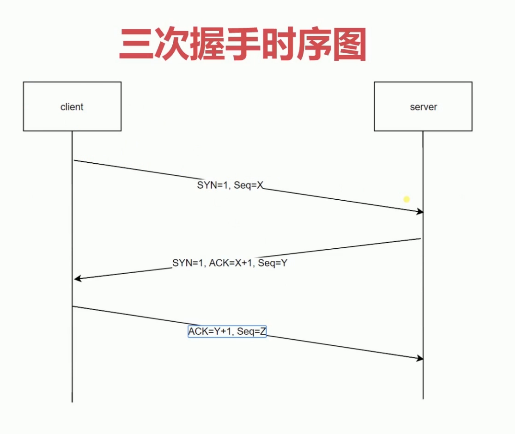

# http基础及发展历史

## 五层模型
- 应用层： http, FTP
- 传输层：TCP, UDP
- 网络层
- 数据链路层
- 物理层

### 物理层
物理层主要作用是定义物理设备如何传入数据

### 数据链路层
数据链路层在通信的实体间建立数据链路连接

### 网络层
为数据在结点之间传输创建逻辑链路

### 传输层
协议：
- TCP/IP
- UDP

- 传输层向用户提供可靠的端到端（end-to-end）服务
- 传输层向高层屏蔽了下层数据的通信的细节

### 应用层

- 为应用软件提供很多服务
- 构建与TCP协议之上
- 屏蔽了网络传输相关的细节

## 发展历史
1. http/0.9
   
2. http/1.0
- 增加了很多命令
- 增加了status code和header
- 多字符集支持、多部分发送、权限、缓存等

1. http/1.1
- 支持持久连接
- pipeline
- 增加了host和其他一些命令

4. http/2.0
- 所有数据以二进制传输
- 同一个连接里发送多个请求不再需要按顺序来
- 头信息压缩以及推送等提高效率的功能

## HTTP三次握手

1. 客户端：发送信息给服务端，我要创建连接； 标志SYN=1,Seq=X
2. 服务端：接收到客户端请求，开启一个TCP端口，返回客户端：SYN=1,ACK=X+1, Seq=Y
3. 客户端：接收到服务端返回的信息，允许客户端创建连接，发送ACK=Y+1, Seq=Z
> X,Y,Z为数字

三次握手是为了防止服务端开启无用的连接。（如：因网络延迟客户端或服务端没有接收到信息，而一直等待在那里，引起额外的开销）

## URI-URL和URN

1. URI：Uniform Resource Identifier, 统一资源标符
    - 用来标识互联网上的信息资源
    - 包含了URL和URN

2. URL：Uniform Resource Locator, 统一资源定位器
    用来找到资源所在的位置；

3. URN：永久统一资源定位符

## HTTP报文格式

1. 请求报文

// 起始行
GET /test/list HTTP/1.1
// 首部
Accept: text/*
...

2. 响应报文
HTTP/1.1 200 ok

// 首部
Content-Type: text/plain
...

// 主体
{
    code: 204
    data: ''
}

3. HTTP方法

- GET
- POST: 用来提交数据的
- DELETE
- PUT: 替换整个资源
- OPTIONS
- HEAD: HEAD方法请求一个与GET请求的响应相同的响应，但没有响应体
- CONNECT
- TRACE
- PATCH: 修改资源的部分内容

> 创建操作可以使用POST，也可以使用PUT
> 区别在于POST 是作用在一个集合资源之上的(/articles)
> 而PUT操作是作用在一个具体资源之上的(/articles/12)

## 创建一个最简单的web服务
