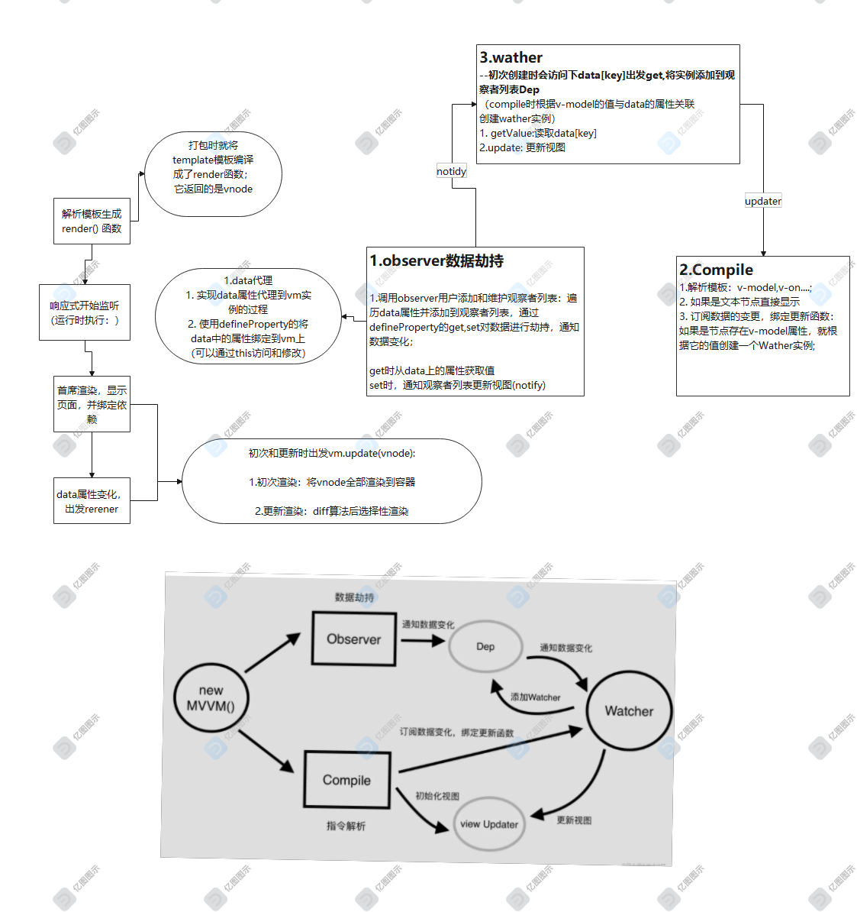

# vue整体流程

1. 解析模板成render函数
2. 响应式开始监听
3. 首次渲染，显示页面，且绑定依赖
4. data属性变化，触发rerender

## 1. 解析模板生成render函数

代码打包时就将模板编译成render函数 返回with()函数即render函数

- 模板中所有的信息都被render函数包含
- 模板中的data中的属性，都变成js变量
- 模板中的v-model,v-for,v-on都编程js逻辑****

```
    with(this){
        return _c(
            ...
        )
    }
```

它最终返回的是vnode

> 详见3.2vue模板解析

## 2.响应式监听

经过打包的代码，在运行的时候执行

- 实现data属性代理到vm的过程？
- 属相加上defineProperty的过程？

```
    // 模拟vue实例
    var vm = {}
    var data = {
            name: 'zhangsan',
            age: 20
        }

        for (let key in data) {
            console.log('key', key)
            data.hasOwnProperty(key) && ((key) => {
                // **代理带vm实例上**
                Object.defineProperty(vm, key, {
                    get: function(){
                        console.log('get', data[key])
                        return data[key]
                    },
                    set: function(newVal) {
                        console.log('set:', newVal)
                        data[key] = newVal
                    }
                })
            })(key)
        }
```

## 3.首次渲染，

**渲染时调用updateComponent()**

```
    function updateComponent(){
        vm._update(vm._render)
    }
```

**vm._update(vnode)**
函数接收vnode判断是否是首次渲染：

- 首次渲染，将虚拟dom转成DOM插入容器
- 如果是更新，通过diff算法比较差异，将需要更新的部分查到响应的位置

```
    vm._update(vnode) {
        const preVnode = vm._vnode // 之前的虚拟dom对象
        vm._vnode = vnode // 新的虚拟dom对象
        if(!preVnode) { // 如果是第一次渲染，将vnode全部渲染到容器里
            vm.$el = vm.__patch__(vm.#el, vnode)
        } else {
            // 如果是更新，对比与之前的preVnode,diff宣发后，选择性渲染
            vm.$el = vm.__patch__(preVnode, vnode)
        }

    }
```

**执行render函数时，会访问到vm[key]**

- 因为data上的属性都设置了defineProperty，因为访问属性值的时候，会触发get;返回data[key]
- 而修改值的时候就会触发set

**为什么需要监听get**:

- data中有很多属性，有些被用到，有些可能不会被用到；被用到的属性会走get,不被用到的属性不会走get;未走get中的属性，set的时候我们也无需关心
- 避免不必要的重复渲染

示例如下： abc在模板中没有被使用，初次渲染时没有执行访问，即没有触发get,如果没有触发过get的属性不会对其进行修改值的监听，也就是不会触发set;避免不必要的重复渲染

```
    <div>{{title}}</div>
    <div>{{name}}</div>

    // ...

    data: {
        title: 'title',
        name: 'wf',
        abc: 123 
    }
```

## 4.data属性变化，更新页面

- 修改了值，触发set
- set后会调用updateComponent--->vm._update(vnode)

vm._update执行如下：

```
    vm._update(vnode) = () => {
        const preVVnode = vm._vnode
        if(!prevVnode){
            // ...
        } else {
            vm.$el = vm.__patch__(prevVnode, vnode)
        }
    }
```

