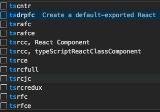
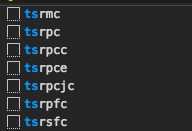

# snippets

## react/redux/Graphql/React-native snippets

### react常用快捷创建代码

**typescript**

- tsrcc: 创建.ts class组件
- tsrfc: 创建.ts function组件
- tsrmc: 创建代码memo的ts组件
- tsrpcc: 创建.ts PureComponent组件

所有快捷命令：

> 去掉'ts'生成js react代码