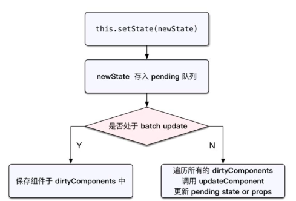

# setState

在入门react时，学到的一个很重要的概念就是：不要直接去修改state,而是使用setState.而是使用setState,为什么要这么做呢？所以需要去了解State和setState的实现机制

原因：

1. 做一定的限制，让开发者不能任意的修改state,而是通过一定的途径来处理，方便管理
2. 提高更新state的效率。

React在处理setState时，会维护一个更新的队列。每次更新setSatet，会合并需要更新的state,加入到队列中，等到执行更新循环时，进行批量更新。

如果你直接修改state,这个修改后的state不会进入这个队列中，所以会跟预期的不一样

## setState为什么不会同步更新组件？

1. setState不会立刻改变React组件的state的值
2. setState通过触发一次组件的更新来引发重绘
3. 多次setState函数调用产生的效果会合并

重绘指的时引起React的更新声明周期函数的4个函数

- shouldComponentUpdate, 被调用时this.state没有更新，返回false，声明周期被终端；返回true时更新
- componentWillUpdate，被调用时this.state没有更新
- render 被调用时this.state得到更新
- componengDidUpdate

目前React会将setState的效果放在队列中，积攒着因此引发更新

为的就是把virtual DOM和DOM树的操作讲到最小，用于提高性能

### setState何时同步更新：

React引发的事务处理，setState都是异步的。其他情况都是同步的，比如

- addEventListener， 直接添加时间处理函数
- setTimeout
- setInterval

简单的说，就是经过React处理的事件是不会同步更新this.state的



在React的setState函数实现中，会根据一个变量**isBatchingUpdates**是直接更新还是翻入队列

**isBatchingUpdates**默认是false,表示同步更新this.state;但是有一个**batchedUpdates**，这个函数会把**isBatchingUpdates**
改为true,而当React在调用事件处理函数之前调用这个batchedUpdates,造成的结果，就是React控制的事件处理过程setState不会同步更新this.state

## setState源码

**setState**:

```
    ReactComponent.prototype.setState = function(partialState, callback) {
        // 将setState事务放入队列中
        this.updater.enqueueSetState(this, partialState)
        if (callback) {
            this.updater.enqueueCallback(this, callback, 'setState')
        }
    }
```

- partialState：有部分state的含义，可见值影响涉及到的state
- enqueueSetState: 是state队列管理的入口方法，比较重要

**replaceState**
replactState中的newState,有完全替换的含义，同样也以队列的形式来管理

```
    replaceState: function(newState, callback) {
        this.updater.enqueueReplaceState(this, newSatte)
        if (callbck) {
            this.updater.enqueueCallback(this, callback, 'replaceState')
        }
    }
```

**enqueueSetState**

```

```

**getInternalInstanceReadyForUpdate**

```
```

**enqueueUpdate**
包含了React避免重复render的逻辑

```
function enqueueUpdate(component) {
    ensureInjected()
    // 如果不是正在处于创建或更新组件阶段，则处理update事务
    if (!batchingStrategy.isBatchingUpdates) {
        batchingStrategy.batchedUpdates(enqueueUpdate, component)
        return 
    }

    // 如果正在创建或更新组件，则暂时不处理update,只将组件放在dirtyComponents数组中
    dirtyComponents.push(component)
}
```

**batchedUpdates**

```
batchedUpdates: function(callback, a, b, c, d, e) {
    var alreayBatchingUpdates = ReactDefaultBatchingStrategy.isBatchungUpdates

    // 批量处理最开始将isBatchingUpdates设为true, 表名正在更新
    ReactDefaultBatchingStrategy.isBatchingUpdates = true;

    // The code is written this way to avoid extra allocations
    if (alreadyBatchingUpdates) {
        callback(a, b, c, d, e);
    } else {
        // 以事务的方式处理updates，后面详细分析transaction
        transaction.perform(callback, null, a, b, c, d, e);
    }}

    var RESET_BATCHED_UPDATES = {
        initialize: emptyFunction,
        close: function() {
            // 事务批量处理结束时，将isBatchingUpdates设为false
            ReactDefaultBatchingStrategy.isBatchingUpdates = false
        }
    }

    var TRANSACTION_WRAPPERS = [FLUSH_BATCHED_UPDATES, RESET_BATCHED_UPDATES];
}
```

mountComponent和updateComponent方法在执行的最开始，会调用batchedUpdates进行批处理更新，此时会将isBatchingUpdates设为true--处于更新节点

之后React以事务的方式处理组件update，事务处理完后会调用wrapper.close() 。

而TRANSACTION_WRAPPERS 中包含了RESET_BATCHED_UPDATES 这个wrapper，故最终会调用RESET_BATCHED_UPDATES.close(),
它最终会将isBatchingUpdates设置为false。

故 getInitialState，componentWillMount， render，componentWillUpdate 中 setState 都不会引起 updateComponent。

但在componentDidMount 和 componentDidUpdate中则会。

## 事务

## 整体流程回顾

1. enqueueSetState将state放入队列中，并调用enqueueUpdate处理要更新的Component
2. 如果组件正在处于update事务中，则现将Componet存入dirtyComponent中。否则调用batchedUpdates处理
3. batchedUpdates发起一次transaction.preform()事务
4. 开始执行事务初始化，运行，结束三个节点
5. 初始化：事务初始化阶段没有注册方法，姑无方法要执行
6. 运行：执行setState时传入callback方法，一般不会传callback
7. 结束：更新isbatchingUpdates为false, 并执行FLUSH_BATCHED_UPDATES这个wrapper中的close方法
8.
FLUSHS_BATCHED_UPDATES的close阶段，会循环遍历所有dirtyComponents，调用updateComponent刷新组件，并执行它的pendingCallback，也就是setState中设置的callback

## 例子
