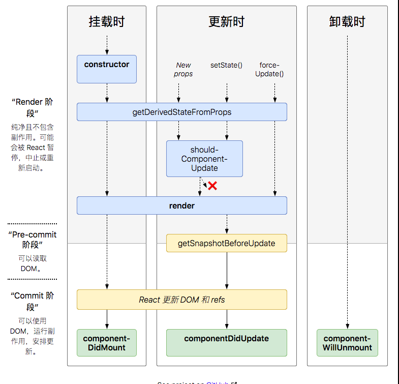

# 生命周期



## 组件生命周期
每个组件都包含”生命周期方法“

### 挂载时
当组件实例被创建并插入DOM中时，其生命周期顺序如下：
1. constructor
2. getDerivedStateFromProps:  从props中获取state
3. render
4. React更新DOM和refs
5. compondntDidMount

### 更新时
当组件的props或state发生变化时会触发更新。

组件更新的声明周期顺序如下：
1. getDerivedStateFromProps :  从props中获取state
2. shouldComponentUpadte
3. render
4. getSnapshotBeforeUpdate: 生命周期在更新之前被调用,

   它使得组件能在发生更改之前从 DOM 中捕获一些信息（例如，滚动位置）。此生命周期的任何返回值将作为参数传递给 componentDidUpdate()。
5. React更新DOM和refs
6. componentDidUpdate

### 卸载时
当组件从DOM中移除时会调用如下方法：

1. componentWillUnmount

### 错误处理

当渲染过程，声明周期，或子组件的构造函数中抛出错误时

会调用如下方法
- static getDerivedStateFromError
- componentDidCatch


### 即将废弃的声明周期

- componentWillMount
- componentWillUpdate
- componentWillReceiveProps

## 不同阶段
1. render阶段：纯净且不含作用。可能会被react暂停，中止或重新启动
2. Pre-commit阶段，可以读取DOM
3. Commit阶段：可以使用DOM，运行副作用，安排更新


## 常用声明周期方法
- render()
- constructor(): react组件在挂载之前，会调用它的构造函数。
- componentDidMount
- componentDidUpdate
- componentWillUnmount(将废弃)

## 不常用的生命周期方法
- shouldComponentUpdate
- static getDerivedStateFromProps(props, state)
    它在调用render方法之前调用，并且在初始挂载及后续更新时被调用。它应返回一个对象来更新state,如果返回null不更新任何内容

- getSnapshotBeforeUpdate(prevProps, prevState)
    它在最近一次渲染输出之前调用。它使得组件能在发生更改之前从DOM中捕获一些信息。此声明周期的任何返回值将作为参数传递给componentDidUpdate
- getDerivedStateFromError:
    在后代组件抛出错误后被调用。它将抛出的错误作为参数，并返回一个值以更新state

- componentDidCatch
    在后代组件抛出错误调用

## Fiber中
```
class Example extends Component{
    // 替换componentWillReveiveProps
    // 初始化和update时调用，（render之前）
    // 静态函数，无法使用this
    static getDerivedSatetFromProps(nextProps, prevState){}

    // 判断是都需要更新组件
    // 可以用于组件性能优化
    shouldComponentUpdate(nextProps, nextState){

    // 替换componentWillUpdate
    // 可以在更新之前获取最新的dom数据
    getSnapshotBeforeUpdate(){}
    
    render(){}
    
    // 组件被挂载后触发
    componentDidMount(){}
    // 组件即将更新
    componentDidUpdate(){}

    // 组件已销毁
    componentDidUnmount(){}
    
}
```
- **使用建议**
    - constructor中初始化state
    - componnetDidMount中进行事件监听，并在componentWillUnmount中解绑事件
    - componentDidMount中进行数据请求，而不是componentWillMount()
    - 需要根据props更新state时，使用getDerivedStateFromProps
    - 可以在componentDidUpdate监听props或者state的变化
    ```
        componentDidUpdate(prevProps){
            if (this.propsid !== prevProps.id){
                this.fetchData(this.props.id)
            }
        }
    ```
    - 在componentDidUpdate使用setState时，必须加条件，否则将进入死循环
    - getSnapshotBeforeUpdate(prevProps, prevState)可以在更新之前获取最新的渲染数据，它的调用是在render知乎，update之前
    - shouldComponentUpdate：默认每次调用setState,一定会最终走到diff阶段，但可以通过以shouldComponentUpdate在声明周期钩子返回false来直接阻止后面的罗技执行。通常是用于做条件渲染，优化渲染的性能

## 新生命周期
### getDerivedStateFromProps

它在调用render方法之前调用，并且在初始化挂载及后续更新时都会被调用。它应该返回一个对象来更新state,如果返回null则不更新任何内容

getDeivedStateFromProps的作用是为了让props能更新到组件内部的state中

它可能的使用场景有以下两种：
- 无条件的根据prop来更新内部state,也就是只要传入prop值，就更新state
- 只有prop值和state值不同时才更新state

### 总结
我们应该谨慎的使用getDerivedStateFromProps这个生命周期。

