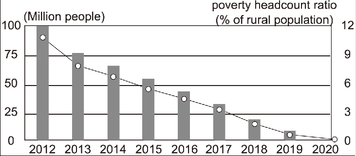

The diagram above clearly reflects that China has made tremendous achievements in poverty alleviation from 2012 to 2020. During this period, China's impoverished rural population decreased considerably from nearly 100 million to nearly zero, a decline of 100 million. At the same time, the poverty headcount ratio also fell from approximately 10% to almost 0%.Several primary factors that account for the above-mentioned changes could be summarized as follows. To begin with, the authorities concerned in China have adopted a combination of conventional and innovative approaches, which have helped improve rural education and healthcare. What is more, our country has put great emphasis on infrastructure establishment in poor rural areas, which has effectively bridged the gap between the rich and the poor. Last but not least, the achievements are attributed to China's speedy economic development during the past several decades.In short, China's poverty alleviation campaign is particularly vital, both nationally and internationally. First of all, anti-poverty achievements allow more people to enjoy the advantages of its economic boom. In addition, the Chinese government has fulfilled its promise of lifting all people out of poverty.

diagram 图表
reflect 显示
make tremendous achievements 取得巨大成就
poverty alleviation 扶贫
impoverished rural population 乡村贫困人口
decrease considerably 大幅下降
decline 减少
at the same time 与此同时
the poverty headcount ratio 贫困人口比例
approximately 大约
primary factors 主要原因
account for 解释
above-mentioned 上述
summarize 概括
as follows 如下
to begin with 首先
authorities concerned 有关当局
adopt 采取
combination 结合
conventional 传统的
innovative 创新的
approach 方法
healthcare 医疗
what is more 此外
put great emphasis on 非常重视
infrastructure establishment 基础设施建设
poor rural areas 农村贫困地区
effectively 有效地
bridge the gap 弥合差距
last but not least 最后
be attributed to 归功于
speedy 迅速的
campaign 战役
vital 非常重要的
first of all 首先
anti-poverty 扶贫
advantage 优点
economic boom 经济繁荣
in addition 其次
fulfill 实现
lift all people out of poverty 全民脱贫

① Enhancing the quality of life in poor areas contributes greatly to regional stability. 提升贫困地区的生活水平非常有助于地区稳定。
② Having witnessed the remarkable achievements in poverty alleviation, we have every reason to believe that we will lead a richer and better life, and our great country will become more thriving and prosperous. 目睹了扶贫方面取得的杰出成就，我们有理由相信我们将过上更加富裕美好的生活，我们伟大的国家将会变得更加繁荣兴旺。
③ China increased its rural employment rate by boosting labor-intensive industries and sent its government officials to work in remote areas. 中国通过发展劳动密集型产业提高农村人口就业率，同时也派遣官员到偏远地区工作。

