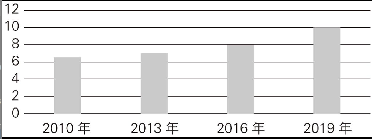

## 压力
## Directions: Write an essay based on the following chart. In your essay, you should

The column chart above clearly reflects the number of hours students spent in studying per day in a certain primary school between 2010 and 2019. From 2010 to 2013, the figure climbed gradually from 6.5 to 7, a rise of merely 0.5. It jumped markedly from 7 to 10 between 2013 and 2019.For the majority of people, stress is a fact of life. As an illustration, school time can be a period of constant pressure for students. Factors like upcoming examinations and endless assignments can exert a strong influence on young people's mental health. Primary school students, who have to juggle daily courses, homework and frequent exams, are particularly susceptible to pressure.In my opinion, by maintaining a healthy lifestyle, keeping an organized calendar and knowing when to relax, people can successfully manage and reduce their stress. To begin with, the most fundamental way that we can mitigate stress is to maintain a healthy lifestyle, which includes adequate sleep, proper exercise and a balanced diet. In addition, people need to relax by watching movies, listening to music, reading a magazine, or chatting with friends, etc.

column chart 柱状图
primary school 小学
figure 数据
climb gradually 缓慢上升
merely 只有
jump markedly 显著上升
as an illustration 例如
constant 不断的
upcoming 即将来临的
endless assignments 无尽的作业
juggle 尽力同时应付（两个或两个以上的重要工作或活动）
frequent 频繁的
be susceptible to 易受……影响
maintain a healthy lifestyle 保持健康的生活方式
an organized calendar 合理的日程安排
successfully 成功地
to begin with 首先
fundamental 根本的
mitigate 缓解
adequate sleep 充足的睡眠
proper exercise 适量的运动
a balanced diet 均衡的饮食
in addition 此外
relax 放松