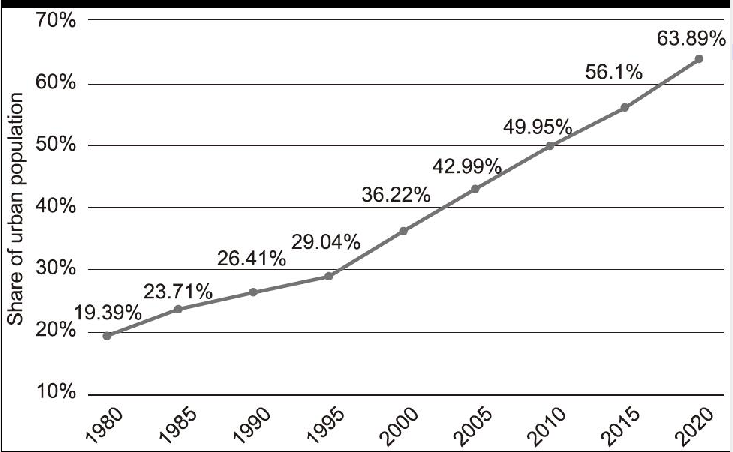

The chart above clearly reveals the degree of urbani-zation in China during the past 40 years. From 1980 to 2010, it jumped markedly from 19.39% to 49.95%, a rise of approximately 30%. The percentage increased steadily from 49.95% to 63.89% between 2010 and 2020, a rise of nearly 14%.It goes without saying that remarkable achievements have been made in China's urbanization since the reform and opening-up in the past few decades. First and foremost, the fundamental contributor for such a sharp increase in urban population results from China's economic prosperity. Furthermore, urbanization has created ample job opportunities for ordinary people, especially for those migrant workers who move to urban areas. More importantly, the authorities concerned have substantially increased infrastructure facilities in urban areas, such as recreational parks and cultural centers, to satisfy the requirements of urban dwellers.Even so, it is also worth mentioning that as people in mounting numbers enjoy the prosperity of modern cities, we cannot ignore the increasing challenges urbanization has posed to natural resources, the environment, job market and public services.

urbanization 城市化
markedly 显著地
approximately 大约
it goes without saying that 毫无疑问
remarkable achievements 巨大成就
the reform and opening-up 改革开放
first and foremost 首先
fundamental contributor 根本原因
result from 源于
economic prosperity 经济繁荣
furthermore 此外
ample job opportunities 大量的就业机会
ordinary people 普通百姓
especially 尤其
migrant workers 外出打工人员
more importantly 更重要的是
authorities concerned 有关当局
substantially 大大地
infrastructure facilities基础设施
recreational park 休闲公园
cultural center 文化中心
satisfy 满足
urban dwellers 城镇居民
it is worth doing 值得做……
in mounting numbers 越来越多的
pose 造成
public service 公共服务

① Urbanization contributes to a diverse economy and thus provides more job vacancies for college graduates and skilled workers. 城市化促使经济多元化，为大学毕业生和技术工人提供更多的就业机会。
② The improved medical system in cities has provided basic medical insurance for over 300 million urban employees. 完善的城镇医疗体系已为三亿多名城镇职工提供基本医疗保险。
③ Based upon the graph, it can be expected that China's urbanization will continue, although the process may slow down. 基于上幅图表，可以预计中国城市化将会继续发展，但进程可能会放缓。

