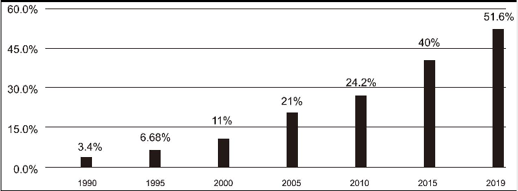

中国高等教育总入学率

The chart clearly reveals the statistics of gross enrolment ratio in higher education in China from 1990 to 2019. Between 1990 and 2010, the percentage increased steadily from 3.4% to 24.2%, a rise of about 21%. It has risen markedly from 24.2% to 51.6% between 2010 and 2019, within not more than ten years.The contributing factors that brought the afore-mentioned changes could be classified as follows. Above all, with the improvement of living standards, there has been a great change in people's ideas about education, and they are becoming increasingly aware of the necessity of receiving higher education. Moreover, China's economic prosperity has been making great contributions to the growth of higher education. Last but not least, with the unwavering governmental support, the reform and development of higher education have made significant achievements in all aspects, including the system of recruitment, fees charging and employment of graduates, ensuring that all citizens have access to higher education.China's success in advancing higher education has made far-reaching impacts on different sectors. To start with, the higher enrolment ratio in universities means a more competitive workforce, which is essential to a sustainable economy. Besides, by bringing up advanced talents and experts, China's higher education promotes scientific development.

gross enrolment ratio 总入学率
higher education 高等教育
rise markedly 显著增长
contributing factors 主要原因
aforementioned 前面提及的
classify 分类
as follows 如下
above all 首先
living standards 生活水平
be aware of 意识到
necessity 必要性
economic prosperity 经济繁荣
make great contributions to 做出巨大贡献
last but not least 最后
unwavering 坚定不移的
governmental support 政府支持
reform 改革
make significant achievements 取得巨大成就
recruitment 招生
fees charging 费用收取
ensure 确保
have access to 可以获得
advance 推进
far-reaching 深远的
sector 领域
to start with 首先
competitive 有竞争力的
workforce 劳动力
essential 关键的
sustainable 可持续发展的
besides 此外
bring up 培养
advanced talent 高级人才
scientific development 科学发展

① The structural reform in higher education has created a boom in colleges and universities, thus making higher education more accessible. 高等教育的结构性改革促进了高等院校的繁荣发展，因此让更多人可以接受高等教育。
②The educated citizens graduating from universities help make strategies that benefit social progress. 在大学接受过教育的公民能帮助制订有利于社会发展的策略。
③Higher education is so crucial that the Chinese government will probably continue to increase its expenditure on it. 高等教育如此重要，中国政府很有可能继续加大这方面的开支。
