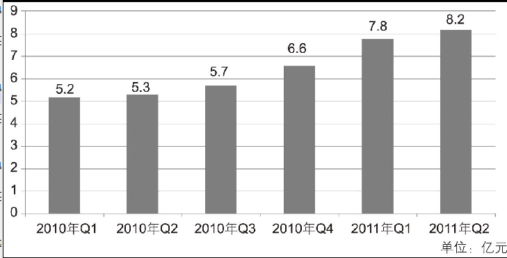

2010年第一季度-2011年第二季度中国网页游戏市场规模

The column chart above reveals the market size of web games in China from the first quarter of 2010 to the second quarter of 2011. During the period of one and a half years, there has been a sudden jump in market size from 520 million yuan to 820 million yuan, a rise of 300 million yuan, at a year-on-year growth rate of more than 50%.When computers' entertaining function is highly spoken of, such a problem does deserve our serious concern. First and foremost, the most serious harm of web games comes from their contents, which greatly affect children's mental health. The majority of games involve violence, such as fighting and killing. To win or kill their opponents, children are permitted to use various tools like guns, knives and bombs. When they are enjoying the pleasure of success, a violent turn of mind is developed and rooted in them, which may induce future violent behavior in their real life. What is more, being indulged in web games also does harm to children's physical health. The radiation from the computer can result in many uncomfortable feelings, such as headache, poor eyesight and dizziness. Being lack of sleep and skipping meals, children are more inclined to get irritable and suffer from severe malnutrition.Of course, it is not the end of the story. Being indulged in web games also affects children's study and their communication with others. All these facts indicate that our society should strengthen the regulation of web games.

web game 网页游戏
quarter 季度
year-on-year 与上年同期相比的
growth rate 增长率
speak highly of 赞扬
serious concern 认真关注
first and foremost 首先且最重要的
induce 引起
do harm to 危害
physical health 身体健康
radiation 辐射
poor eyesight 视力不佳
be inclined to 容易，倾向于
irritable 暴怒的，脾气暴躁的
malnutrition 营养不良
（四）“道长”点评
考研英语写作大作文有三大评分标准：一是关联词，即过渡性词语，一般小作文使用3~5 个左右，大作文使用5~7 个左右；二是同义替换，最好不要反复使用同样的词汇及句子结构；三是代词替换，可以使用代词尤其是物称代词来替代名词、短语或句子。
（五）经典句型
① The majority of modern-day games are based on fantasy and they cannot teach us much about life. 如今的游戏多数都基于虚幻，它们不能教给我们很多有关生活的真谛。
② A good many middle school and high school boys spend numerous weekend hours glued to their computers, playing the latest fantasy games. 许多初高中的男生在周末花大量时间盯着电脑屏幕，玩最新潮的虚幻游戏。
③ Many outstanding students flunked because they could not concentrate on the study for being too indulged in Internet games. 很多优秀学生由于太过沉迷于网络游戏而无法专心学习，导致考试不及格。