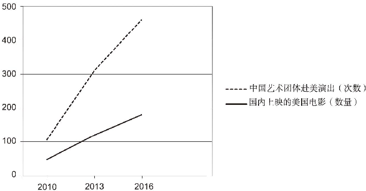

2010年-2016年中国艺术团体赴美演出次数及国内上映的美国电影数量

It is apparent from the line graph that the number of times of Chinese art groups performing in the U.S. and American movies shown in China both increased between 2010 and 2016. During the seven years, the number of times of Chinese art groups performing in the U.S. jumped from 100 to 460, whereas the statistics of American films shown in our country had been on a steady rise from 50 to 180, a rise of 130.Firstly, the fact that people from different countries are attracted by mysterious Chinese culture indicates that to some extent a culture can be accepted, respected, appreciated and shared internationally. Secondly, a nation's unique culture can become international through worldwide economic and cultural exchanges. Since the trend of globalization becomes irresistible, the increasing cultural exchanges can effectively improve mutual understanding and friendship.It is my view that national culture as priceless spiritual treasure should be preserved and cherished. Meanwhile, there are good reasons to advocate international culture because those ideas from other cultures, controversial or even absurd at first sight, can provide a different perspective for us to observe the world in the long run. Nevertheless, when we are confronted with a different culture, we should be sensible enough to absorb its essence and to resist its dark side. Only in this way can we promote cultural development positively and make our world multidimensional, colorful and vigorous.

art group 艺术团体
mysterious 神秘的
cultural exchange 文化交流
globalization 全球化
irresistible 不可阻挡的
mutual 相互间的
national culture 民族文化
priceless spiritual treasure 无价的精神财富
preserve 保存
advocate 推广
international culture 世界文化
controversial 有争议的
at first sight 乍看起来
perspective 视角
be confronted with 面临
sensible 理智的
absorb its essence 取其精华
resist its dark side 去其糟粕
multidimensional 多面的
vigorous 充满活力的

① Over the course of thousands of years, Chinese people have created their own unique customs and traditions, and passed them on from one generation to the next. 在几千年的历程中，中国人民创造了独特的习俗和传统，并将它们代代相传。
② In recent decades, however, some people have become increasingly concerned that China's cultural heritage could become marginalized or even disappear entirely. 然而，最近几十年来，一些人越来越担心中国的文化遗产可能会遭到排挤甚至完全消失。
③ Whether through kung fu schools in New York, the United States or Chinese calligraphy exhibits at the Museum in Paris, France, many people around the world now have the chance to learn about China's 5,000-year-old culture, which ensures that its reach and influence extend well beyond China's own boarders. 无论是通过美国纽约的武术学校，还是法国巴黎博物馆的书法展，现在世界上很多人都有机会了解中国五千年的文化，可以确保中国文化的影响力越过国界，延伸到全球。