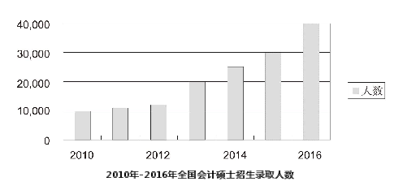

The diagram above clearly illustrates that dramatic elevation has occurred in the recruitment of Master of Professional Accounting (MPAcc) from 2010 to 2016. In 2010, the number was at a low level, only about 10,000. Surprisingly, within no more than seven years it reached to more than 40,000 in 2016.Some driving factors that contribute to the above-mentioned changes may be summarized as follows. First and foremost, China has become particularly active in the economy, which leads to the increasing demand for qualified accountants. In addition, the development of the job market on the whole cannot keep pace with the expansion of college graduates, which obliges a large number of students to stay on campus for another three years to get better prepared for their career. Last but not least, working pressure is another reason. Taking all these factors into account, we may predict that with speedy development of our society, the number of recruitment of MPAcc will keep growing in the forthcoming decade.On the other side of the coin, however, this tendency may bring about a good many problems, such as the waste of talent. It is necessary for us to take effective measures to ensure this situation doesn't get out of hand, and encourage students to choose majors with theoretical knowledge and practical skills that will be demanded in the job market.

diagram 图表
clearly 清晰地
illustrate 阐明，说明
dramatic 急剧的
elevation 提高
recruitment 招生
Master of Professional Accounting 会计硕士
at a low level 处于较低水平
surprisingly 令人惊讶地
contribute to 促成
above-mentioned 上述提及的
summarize 总结
as follow 如下
first and foremost 首先
qualified 合格的
accountant 会计
job market 就业市场
on the whole 总体上
keep pace with 保持同步
expansion 扩张
oblige 迫使
a large number of 大量的
get prepared for 为……做准备
last but not least 最后
working pressure 工作压力
take...into account 考虑
predict 预测
speedy 迅速的
forthcoming 即将发生的
on the other side of the coin 事情的另一方面
tendency 趋势
bring about 带来
a good many 很多
take effective measure 采取有效措施
ensure 确保
get out of hand 失控
encourage 鼓励
theoretical knowledge 理论知识
practical skill 实践技能
demand 需求

① The challenges Chinese education system faces are enormous by world standards. 从世界标准来看，中国教育体制面临的挑战是巨大的。
② The education system, like every other system, always requires improvement and it is up to the teachers to continually seek the most effective teaching techniques. 和其他体制一样，教育体制经常需要改进，而且要靠教师们不断地寻找最有效的教学方法。
③ Teaching foreign languages needs to focus more on the practical use of the language rather than just teaching to pass written exams. 外语教学需要更加重视语言的实际应用能力，而不是只教学生如何通过书面考试。