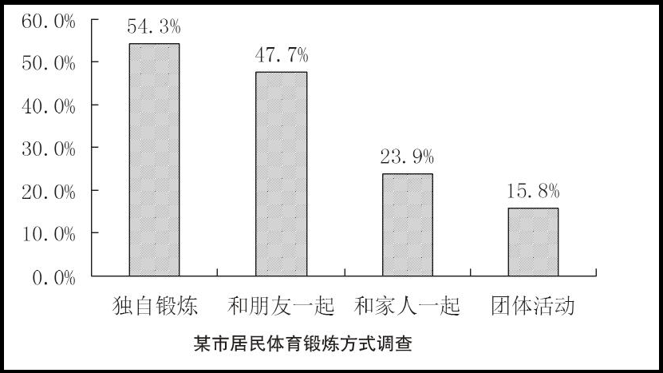
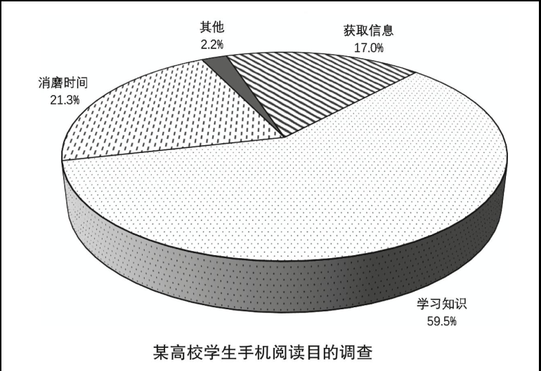
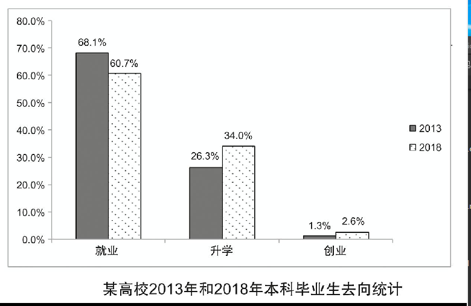
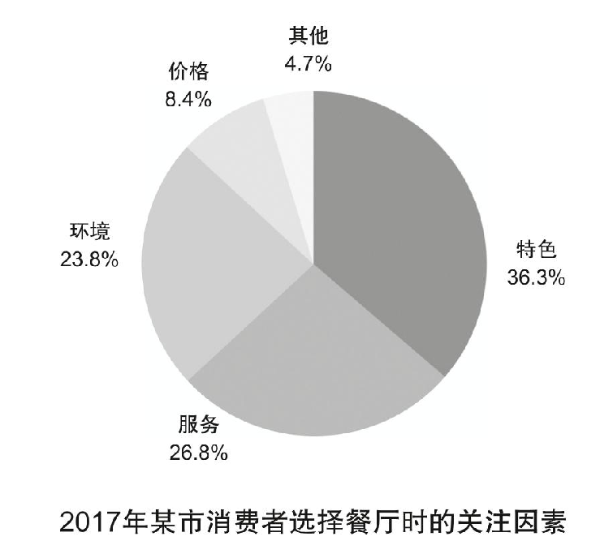
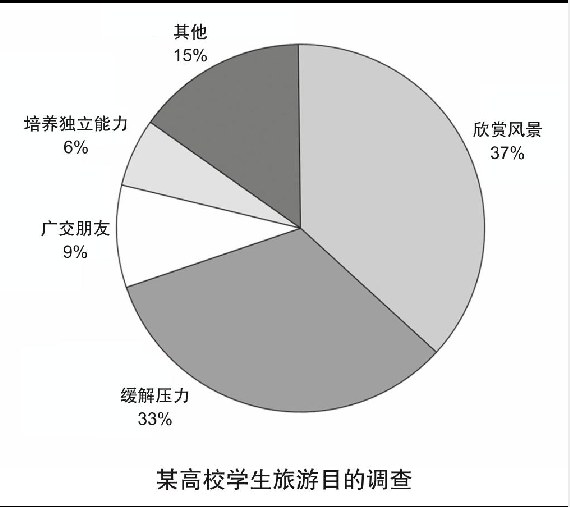

## 2022

# 2021
## Part B 

Directions:Write an essay based on the chart below. In your writing, you should
1) interpret the chart, and
2) give your comments.
You should write about 150 words on the ANSWER SHEET. (15 points)

# 2020
## B 饼图
Write an essay based on the chart below. In your writing, you should
1) interpret the chart, and
2) give your comments.
You should write about 150 words on the ANSWER SHEET. (15 points)

# 2019
## B 
Part B48. Directions:Write an essay based on the chart below. In your writing, you should
1) interpret the chart, and
2) give your comments.
You should write about 150 words on the ANSWER SHEET. (15 points)

# 2018 
## Part B48. 

Directions:Write an essay based on the following chart. In your essay, you should
1) interpret the chart, and
2) give your comments.
You should write about 150 words neatly on the ANSWER SHEET. (15 points)

# 2017
## Part B48. 

Directions:Write an essay based on the chart below. In your writing, you should
1) interpret the chart, and
2) give your comments.
You should write about 150 words on the ANSWER SHEET. (15 points)

# 2016

## Part B48. 

Directions:Write an essay based on the chart below. In your writing, you should
1) interpret the chart, and
2) give your comments.
You should write about 150 words on the ANSWER SHEET. (15 points)

# 2015 公告
## Part B48. 饼图

Directions:Write an essay based on the following chart. In your writing, you should
1) interpret the chart, and
2) give your comments.
You should write about 150 words on the ANSWER SHEET. (15 points)

# 2014 请求信

## Part B48. 
Directions:Write an essay based on the following chart. In your writing, you should
1) interpret the chart, and
2) give your comments.
You should write about 150 words on the ANSWER SHEET. (15 points)

# 2013 请求
## Part B48. 柱状图 
Directions:Write an essay based on the following chart. In your writing, you should
1) interpret the chart, and
2) give your comments.
You should write about 150 words on the ANSWER SHEET. (15 points)

# 2012
## Part B48.
 Directions:Write an essay based on the following table. In your writing, you should
1) describe the table, and
2) give your comments.
You should write at least 150 words.

# 2011

# 2010